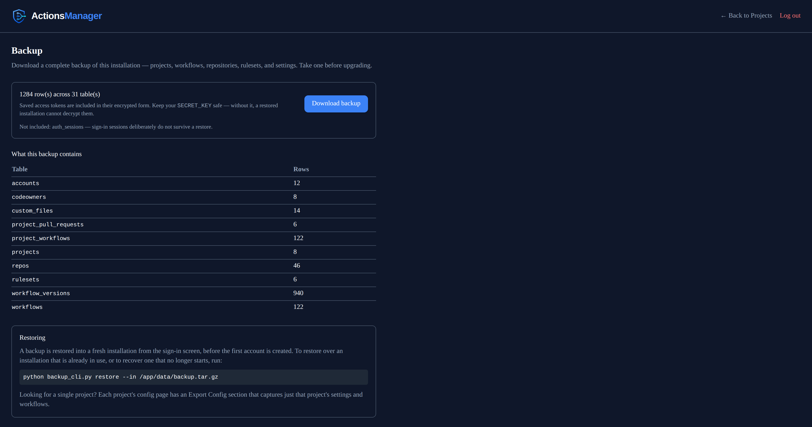
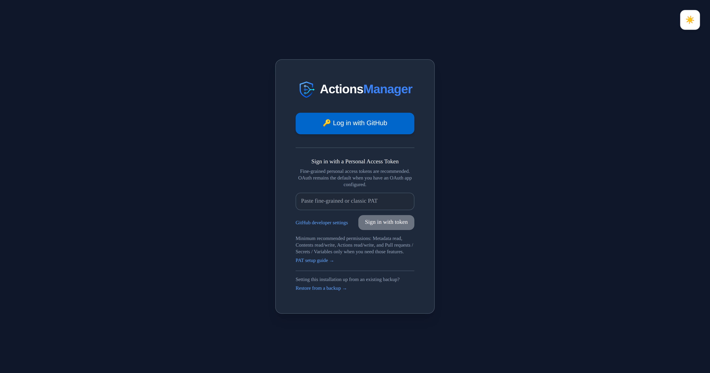
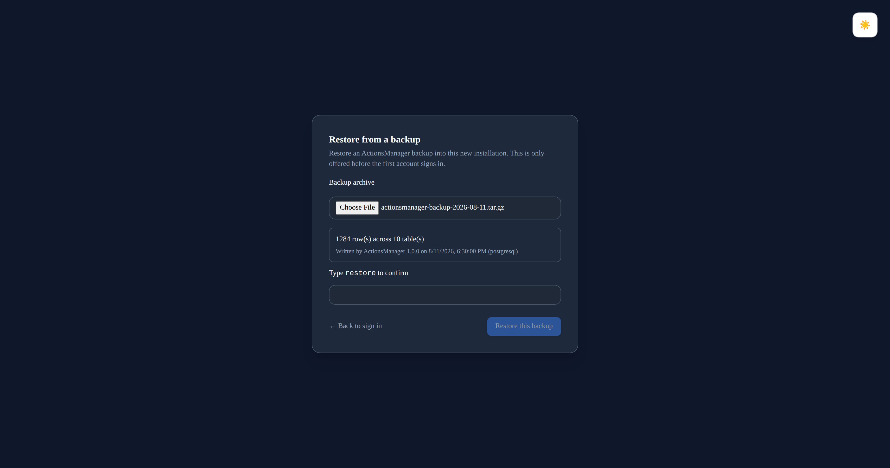
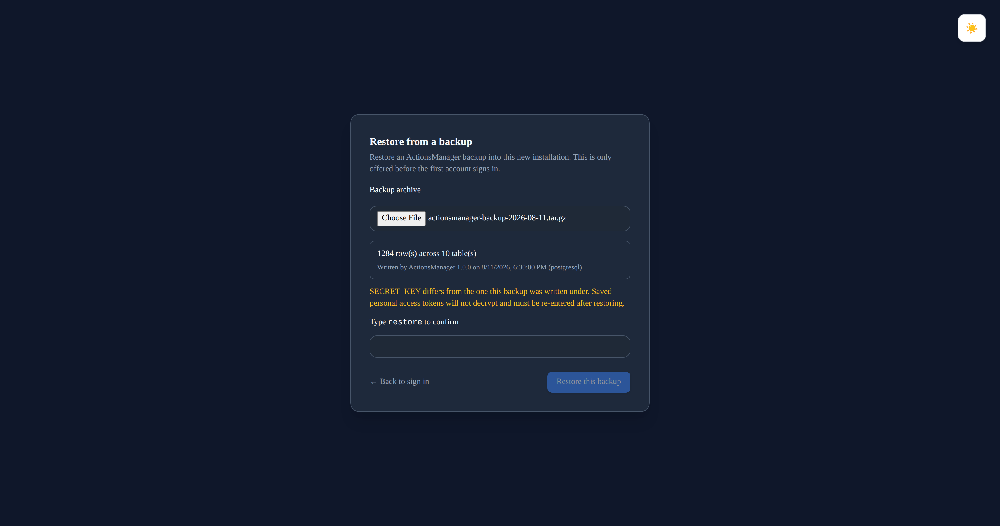
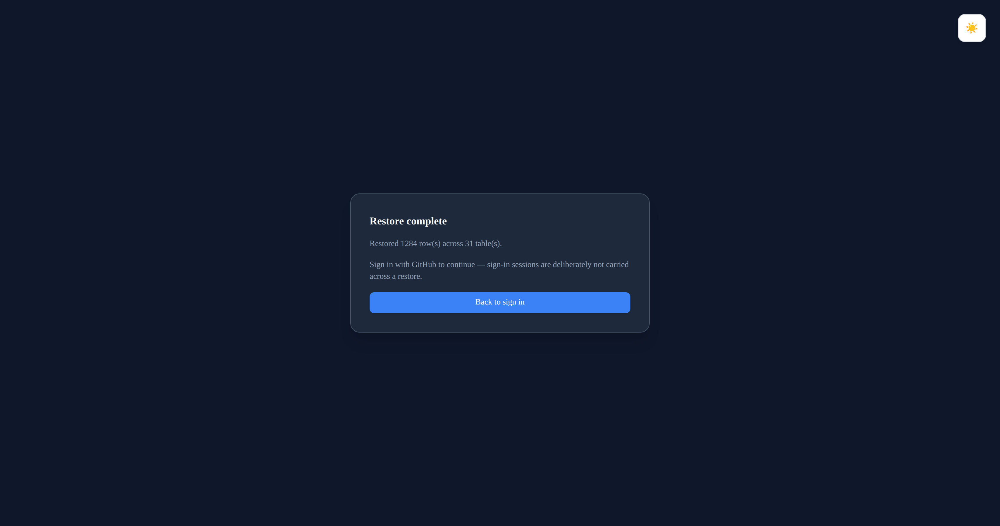

# Backup & Restore
{: .no_toc }

Take a complete copy of your installation before an upgrade, and restore it into a fresh one if something goes wrong.
{: .fs-6 .fw-300 }

<details open markdown="block">
  <summary>Table of contents</summary>
  {: .text-delta }
1. TOC
{:toc}
</details>

---

## What a backup contains

A backup is a single compressed archive holding every table in your installation — accounts and
workspace roles, projects, repositories, workflows and their version history, rulesets,
CODEOWNERS, custom files, pull request history, and drift state.

Alongside the data it records what is needed to restore it safely: the ActionsManager version
that wrote it, a checksum for every table, and the list of database migrations the installation
had applied. That last item is how a restore knows whether an archive is older, newer, or a
match for the installation receiving it.

Two things are deliberately left out:

- **Sign-in sessions.** They are neither backed up nor preserved through a restore, so no one
  stays signed in across one.
- **Nothing decrypted.** Saved GitHub tokens are copied in the encrypted form they are already
  stored in. They are never decrypted to make a backup.

## Downloading a backup

Workspace admins open the account menu and choose **Backup**. The page shows what the archive
will contain before you take it.



Downloading is read-only and safe to do at any time — it does not lock the database or
interrupt anyone working.

From the command line:

```bash
docker compose -f docker-compose.self-hosted.yml exec app \
  python backup_cli.py backup --out /app/data/backup-$(date +%Y%m%d).tar.gz
```

The archive is interchangeable between SQLite and PostgreSQL, so a backup taken from one
restores into the other.

## SECRET_KEY

Saved GitHub tokens are encrypted with a key derived from `SECRET_KEY`, and they stay encrypted
in the backup. **Only an installation using the same `SECRET_KEY` can decrypt them.**

- Keep `SECRET_KEY` somewhere separate from your backups. Without it, restored tokens are
  unrecoverable; stored *with* them, the encryption stops being worth anything.
- Restoring under a different key still works. Everything except saved tokens comes back, and
  each user re-enters their token. ActionsManager detects this and warns you before you commit
  to the restore rather than leaving you to discover it afterwards.

## Restoring into a fresh installation

Restore is offered in the browser only while an installation is new — before the first account
signs in. Start the new container, open it, and the sign-in screen offers the option:



Choose the archive and ActionsManager checks it before writing anything, reporting what it
holds and which version wrote it:



Nothing is applied until you type the confirmation phrase. If the archive was written under a
different `SECRET_KEY`, the report says so — the restore is still allowed, because everything
except saved tokens recovers normally:



An archive that fails its checksum, or that came from a **newer** version of ActionsManager
than the one you are restoring into, is refused outright and no confirmation is offered.
Upgrade first, then restore.

When it finishes, sign in as you normally would. Your account is already in the restored data
with the role it had:



## Restoring from the command line

Once an installation is in use, the browser no longer offers a restore — overwriting live data
is a deliberate act, and it takes the CLI. This is also the only option that helps when an
installation no longer starts, which is the situation backups exist for.

```bash
# Check an archive without changing anything
docker compose -f docker-compose.self-hosted.yml exec app \
  python backup_cli.py validate --in /app/data/backup-20260811.tar.gz

# Report what a restore would do, without writing
docker compose -f docker-compose.self-hosted.yml exec app \
  python backup_cli.py restore --in /app/data/backup-20260811.tar.gz --dry-run

# Apply it
docker compose -f docker-compose.self-hosted.yml exec app \
  python backup_cli.py restore --in /app/data/backup-20260811.tar.gz
```

Restoring replaces all existing data. The CLI refuses an installation that already has users
unless you pass `--force`.

Every restore validates integrity and version compatibility *before* changing anything, applies
the data in a single transaction, and then runs any migrations the archive predates. A rejected
archive leaves the installation exactly as it was.

## Before you upgrade

Take a backup before every upgrade. If a migration fails:

1. Roll the image back to the version you were on.
2. Restore the backup you took beforehand.
3. Confirm the application starts and your projects are there.

[Deployment guide → Backup & Recovery](../DEPLOYMENT.md#backup--recovery) covers scheduling
backups, automating them with cron, and the raw database-copy alternative.

## Backing up a single project

A backup covers the whole installation. To capture just one project's configuration — to move
it to another installation, or to snapshot it before a large change — use **Export Config** on
that project's config page instead.

The two are not interchangeable. A project export carries configuration only: no accounts, no
credentials, no pull request history, no drift state. It cannot restore an installation, and it
is available to anyone with access to the project rather than workspace admins alone.

## Current limitations

- Restoring through the browser is only available before the first account signs in. Everything
  after that is a CLI operation.
- Restoring replaces the whole installation; there is no way to restore a single project from a
  full backup.
- Importing a project export back into an installation is not supported yet — see
  [issue #1883](https://github.com/dawg-io/actions-manager/issues/1883).
