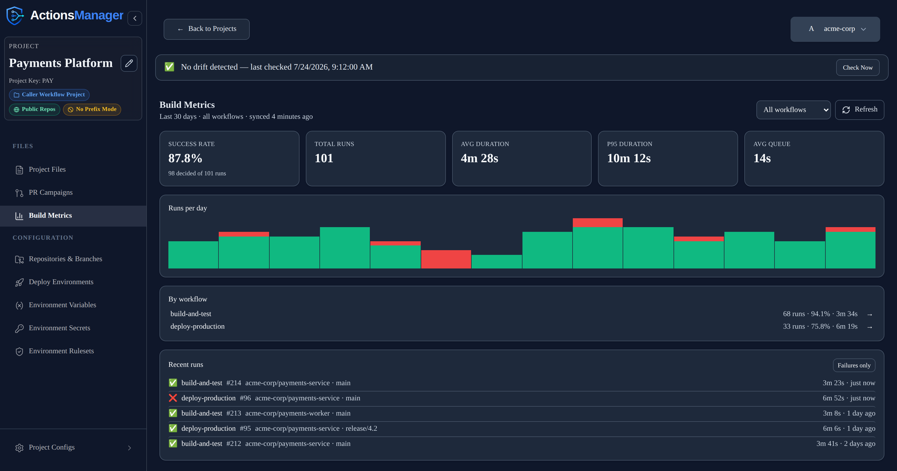
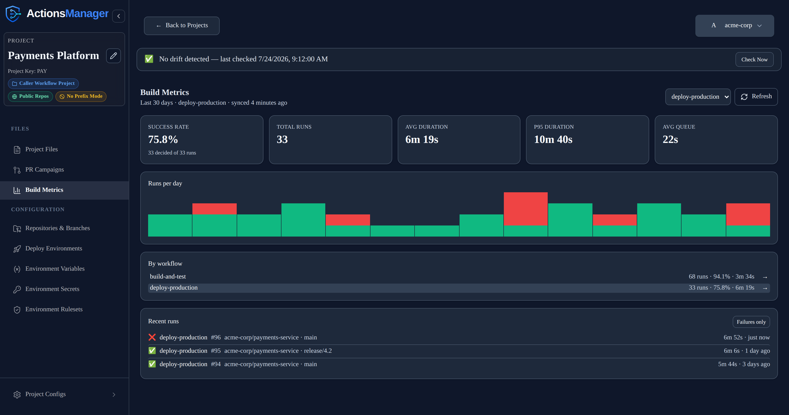

# Build Metrics
{: .no_toc }

See how your managed workflows actually perform — success rates, durations, queue time and trend —
and click through to any individual run on GitHub.
{: .fs-6 .fw-300 }

  
Table of contents

  {: .text-delta }
1. TOC
{:toc}

---

## What Build Metrics Shows

ActionsManager delivers workflows to many repositories, but until a run finishes there is no single
place to see whether those workflows are actually healthy. **Build Metrics** answers that per
project: how often builds pass, how long they take, how long they wait to start, and which workflow
is responsible when the number moves.

Open a project and choose **Build Metrics** in the sidebar.

The panel has four parts:

| Section | What it tells you |
|---|---|
| **Stat tiles** | Success rate, total runs, average and p95 duration, and average queue time for the current scope |
| **Runs per day** | A daily bar per day in the window — bar height is the run count, the red portion is failures |
| **By workflow** | Every workflow in the project with its own run count, success rate and average duration |
| **Recent runs** | The newest runs, each linking to that run on GitHub |

## What the Numbers Mean

**Success rate counts only runs that reached a verdict.** A cancelled or skipped run says nothing
about whether the code was good, so it is excluded from the calculation — it would otherwise drag the
number down every time someone cancelled a queued build. The tile shows the denominator explicitly
("98 decided of 101 runs") so the gap between the two is always visible.

Runs still in progress are counted in **Total runs** but not in the success rate, so a queue of
pending builds never looks like a drop in quality.

**A dash (`—`) is not zero.** When no run in the window has reached a verdict, the success rate
renders as `—`, never as `0%`. "No data yet" and "everything failed" look completely different on
purpose.

**Duration** is measured from when a run started executing to when it finished, so it excludes time
spent waiting for a runner. That waiting time is reported separately as **queue time**. Only
completed runs contribute to duration.

**p95 duration** is the run that 95% of runs are faster than — a better signal for "how bad does this
get" than an average, which a handful of slow outliers can hide.

## Viewing One Workflow at a Time

Project-wide averages hide which workflow is the problem. Scope the panel to a single workflow and
every figure — success rate, durations, queue time, the trend chart and the run list — narrows to
just that workflow.

There are two ways to switch:

- The **workflow dropdown** at the top right — pick any workflow, or **All workflows** to go back.
- Clicking a row in the **By workflow** list. Click the same row again to clear the scope.

The heading always states what the numbers describe (`Last 30 days · deploy-production`), and the
**By workflow** list deliberately keeps showing every workflow with its project-wide totals while
scoped — it is how you switch to another one.

## Investigating a Build

Every row in **Recent runs** links to that run on GitHub, so a failure is one click from its logs.
Rows show the conclusion, workflow, run number, repository, branch, duration and how long ago it ran.

Use **Failures only** to narrow the list to failed runs. The filter is applied across the whole
retention window rather than just the runs already on screen, so it will find a failure even if
recent activity has pushed it out of view. It narrows **only the list** — the success rate and the
other tiles keep describing every run, so the headline number never changes just because you filtered.

In the **By workflow** list, the `→` beside a workflow opens that workflow's Actions page on GitHub.
For a workflow delivered to several repositories it points at the repository it most recently ran in.

## How the Data Is Collected

Runs are stored by ActionsManager and the metrics are computed from that stored copy, so opening the
panel costs no GitHub API calls no matter how often you do it.

- A **sync** happens when the stored data is older than the sync interval (15 minutes by default), or
  immediately when you press **Refresh**.
- Each sync lists runs **once per repository** — a single call returns every workflow's runs — rather
  than asking per workflow.
- Only runs belonging to workflows the project manages are stored. Other workflows living in the same
  repository are ignored.
- Reusable workflow projects are never synced. A `workflow_call` workflow executes inside its
  caller's run and produces no run of its own, so there would be nothing to collect.

If a sync fails — an expired token, a rate limit, GitHub returning an error — the panel keeps showing
the last known numbers with a warning above them rather than going blank. The numbers are never
presented as fresh when they aren't: the heading shows when the data was actually synced, and reads
**not synced yet** when it never has been.

## Retention

Tiers differ only in how much history they keep. Every tier sees the same panel and the same
features.

| Tier | History kept |
|---|---|
| Free | 30 days |
| Professional | 90 days |
| Enterprise | Unlimited |
| Self-hosted beta | 30 days |

Runs older than the retention window are removed on the next sync. Asking for a wider window than
your tier keeps simply shows what is retained — the heading always states the window actually
applied.

## Configuration

| Variable | Required | Default | Description | Mode | Example |
|----------|----------|---------|-------------|------|---------|
| `BUILD_METRICS_SYNC_INTERVAL_MINUTES` | ❌ No | `15` | How stale stored runs must be before opening the panel triggers a sync | Both | `30` |

Raise it if you run many projects against a tight GitHub rate limit; **Refresh** always syncs
regardless of the interval.

## Not Included Yet

Deliberately out of scope for now, so the panel stays cheap to open:

- **Per-job breakdown** and **billable minutes / cost estimation** — both require one additional
  GitHub API call *per run*, which would make opening a busy project's panel cost hundreds of calls.
- **Run logs and re-running a build from ActionsManager** — use the GitHub links for now.
- **Alerting on failures** — no notifications are sent from Build Metrics.

## Related

- [Drift Detection](drift-detection.md) — whether the workflow *file* in GitHub still matches what
  ActionsManager manages, which is a different question from whether it passes
- [PR Campaigns](pr-campaigns.md) — delivering workflow changes to repositories
- [Notifications](notifications.md) — email and webhook alerts for drift and campaign events
