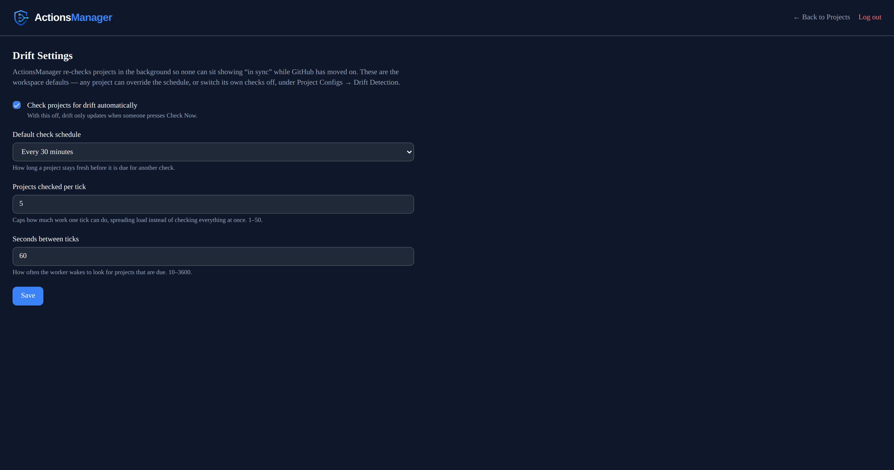
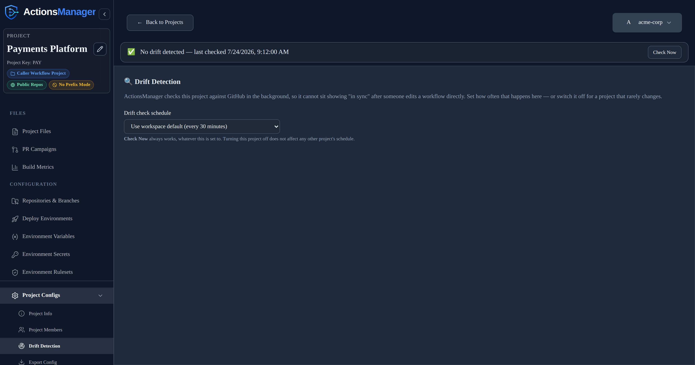
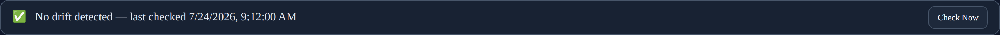
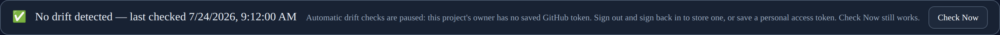
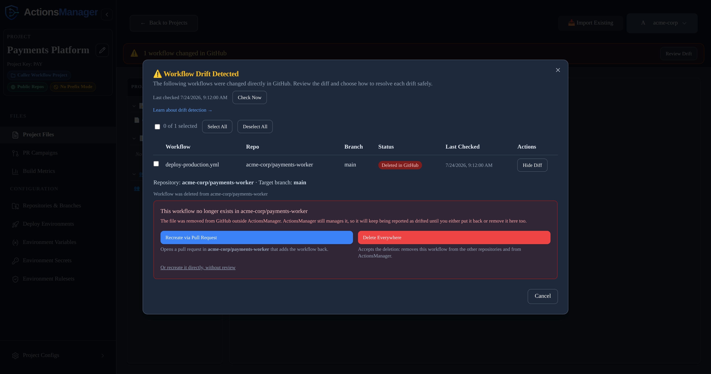
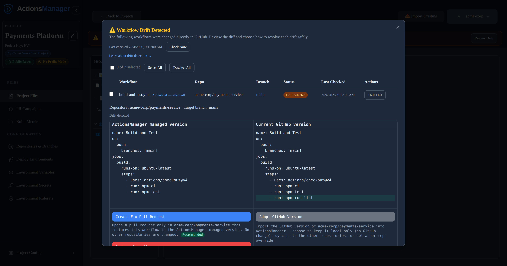
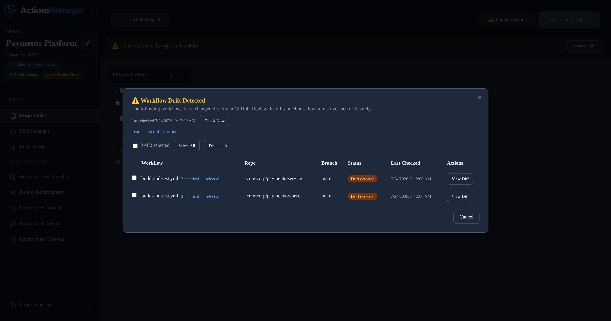
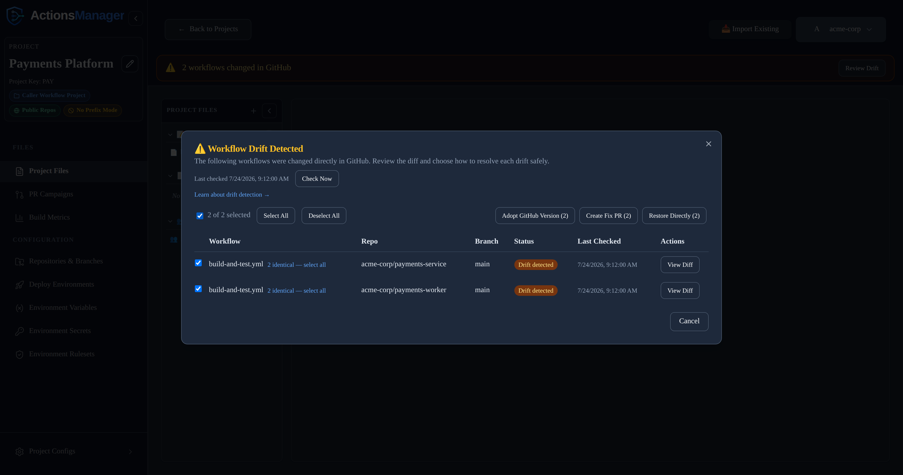

# Drift Detection
{: .no_toc }

Continuously detect when repositories diverge from their managed workflow state and resolve the differences.
{: .fs-6 .fw-300 }

  
Table of contents

  {: .text-delta }
1. TOC
{:toc}

---

## What is Drift?

**Drift** occurs when the workflow content in a repository diverges from the definition managed by ActionsManager. Common causes include:

- Manual edits to workflow YAML files in the repository
- Direct commits that bypass ActionsManager
- Merging PRs that modify managed workflow files outside of a campaign
- Workflow files deleted or renamed in the repository — the managed filename is gone, so it reads
  as deleted
- Someone reverting or re-editing a file ActionsManager delivered

Drift always means **GitHub changed underneath ActionsManager**. A change you made *inside*
ActionsManager and haven't delivered yet is not drift — see [What Counts as Drift](#what-counts-as-drift).

## How Drift Detection Works

ActionsManager compares the **managed definition** it holds for each workflow against the file that
is actually in the repository, for every repository and branch the project delivers to. When they
differ, that (workflow, repository, branch) is marked as **drifted**.

For each repository and branch, a check:

1. Lists `.github/workflows/` in a single call, which returns the current Git SHA of every workflow
   file on that branch.
2. Compares each managed workflow's stored SHA against the SHA in that listing. Matching SHAs mean
   no drift, and no further calls.
3. Fetches the full file only for workflows whose SHA differs, then compares the content.

Content comparison ignores differences that carry no meaning: line endings (CRLF vs LF), trailing
whitespace on a line, and a missing or extra final newline. **Everything else counts** — comments,
key order, indentation and blank lines are all part of the comparison, because ActionsManager
delivers the file exactly as stored. When content matches despite a different SHA (someone
committed the same bytes another way), the workflow is in sync and ActionsManager quietly re-records
GitHub's SHA so the file isn't re-fetched on the next check.

The file compared is the one ActionsManager would deliver: the project's workflow, under the
filename the project's prefix setting produces. Workflow files in the repository that this project
does not manage are never examined, and a file carrying a different project's code is skipped rather
than reported as drift.

If a repository has a **repo-specific override** for a workflow, that repository is compared against
the override rather than the shared project workflow. That is what an override is for — a
deliberately different copy stops reporting drift.

## When Drift Is Checked

**Automatically, in the background.** ActionsManager re-checks projects on its own, so a project
cannot sit showing "in sync" while GitHub has moved on. By default a project becomes due for a
re-check 15 minutes after its last one, and only a few projects are picked up per tick so the load
stays spread out.

**Workspace admins set the defaults.** Under **Drift Settings**, an admin can switch automatic
checking off entirely, change how long a project stays fresh before it is due again, and tune both
how many projects are picked up per tick and how often those ticks happen. Changes apply from the
next tick — no restart. With automatic checking off, drift only updates when someone presses
**Check Now**.

**Each project can set its own schedule.** Open a project, then **Project Configs → Drift
Detection**, and pick a schedule for that project alone — so you can configure checking on an
as-needed basis:

| Setting | What it does |
|---|---|
| Use workspace default | Follows whatever the admin configured. This is how every project starts. |
| Off | This project is never checked automatically. **Check Now** still works. |
| Every 15 / 30 minutes | For projects edited often, or where drift matters quickly. |
| Every hour / 6 hours | A middle ground for steadier projects. |
| Daily | For projects that rarely change, or to keep API usage down. |

Turning a project off does not slow down the projects behind it, and it never
affects any other project's schedule.

**On demand, with Check Now.** A project with no known drift shows a status row with a **Check Now**
button; when something is drifted, **Review Drift** opens the list, which carries **Check Now** next
to the last-checked time. Either one runs a live check immediately, using your own credentials.

**Opening a project does not run a check.** The drift panel is served from the last stored result
and costs no GitHub API calls, so opening a project page as often as you like is free. The panel
always says *when* that result was established — "last checked …", or "Not checked yet" if no check
has ever completed.

**Actions that fix drift update the stored state directly.** Merging a fix PR, restoring the managed
version, adopting GitHub's version, syncing other repositories, and deleting a workflow all clear
the drift they resolved, for exactly the repositories and branches they touched. The banner clears
straight away — there is no wait for the next sweep, and no extra GitHub calls.

Two things the background sweep deliberately does **not** do:

- **It never writes to GitHub.** The sweep only reads and reports. Every change to a repository
  still comes from you choosing a resolution.
- **It never claims a check that didn't happen.** If a project can't be checked, its last-checked
  time stays where it was instead of moving forward.

### When automatic checks pause

The background sweep runs with nobody logged in, so it needs a credential stored on the server. It
checks a project only when the project's **owner** has one.

Signing in stores that credential, so a normal GitHub login is enough — it survives restarts and is
shared across replicas. A saved personal access token works too, and takes precedence.

The one case that still pauses: an account that was already signed in before this behaviour shipped.
Its credential exists only in the server's memory, and gets written to storage on that account's
next request — but only while that same process is still running. If the server restarts first,
there is nothing left to recover, and the owner has to sign in again once (or save a PAT).

A project the sweep can't check is skipped, keeps its previous result and timestamp, and the drift
panel explains why:

> Automatic drift checks are paused: this project's owner has no saved GitHub token. Sign out and
> sign back in to store one, or save a personal access token. Check Now still works.

**Check Now** still works in that state.

A project whose checks keep failing — an expired token, a rate limit, a repository that can no
longer be read — is retried progressively less often: the wait doubles with each consecutive
failure, up to 32× that project's own schedule. The first successful check restores the normal
cadence.

## What Counts as Drift

Drift is a list of things *someone else* changed. Work in progress inside ActionsManager is tracked
as a [workflow status](#workflow-status) instead, so it never
pollutes that list.

| Situation | Reported as drift? | What you see instead |
|---|---|---|
| The file in GitHub differs from the managed version | **Yes** | Drift detected, with a diff |
| The managed file is gone from GitHub | **Yes** | Deleted in GitHub |
| You edited the workflow in ActionsManager and haven't delivered it yet | No | Workflow status **Committed Locally** — pending delivery |
| The workflow is in an open ActionsManager pull request that changes it | No | Workflow status **Under Review** |
| The workflow is missing from the branch, but an open ActionsManager PR would add it | No | Pending merge |
| The workflow has never been delivered to that repository | No | Nothing — there is no delivered file to compare against |
| The file differs only in line endings, trailing spaces or its final newline | No | In sync |
| The repository has a repo-specific override and matches it | No | In sync — compared against the override |
| GitHub could not be queried | No | "Couldn't check N workflows" / *Needs attention* — never reported as in sync |

An open pull request suppresses drift only for the workflows that PR actually carries, in that one
repository. Everything else in the project is still checked normally. Closing a fix PR without
merging it does **not** suppress drift: the file in GitHub still differs, so it is reported again on
the next check.

## Which Branches Are Checked

Drift is checked against **the branches the project delivers to** — the same branches
ActionsManager writes when it syncs, resolved from the project's
[branch configuration](#branch-configuration) and any per-repository
override.

- **Default branch** mode compares against the repository's default branch.
- **Pattern** mode compares against every branch matching the pattern (subject to the recency
  filter), and each is reported separately.

So a project targeting `release/*` is compared against those release branches, not against `main`.
A workflow can be in sync on `release/2.0` and drifted on `release/2.1`; the drift table shows one
row per branch, with its own diff and its own resolve action. Resolving drift on one branch does
not affect the others.

Because each branch is tracked independently, drift appearing on a second branch raises its own
notification rather than being folded into the first.

Pattern mode also applies a **recency filter** — 30 days by default. Branches that match the pattern
but have had no commit inside that window are skipped, so long-dead release branches aren't checked
forever. A repository can override the whole branch configuration for itself — option, pattern and
recency window — and drift honours that override exactly as delivery does.

If pattern mode matches nothing (no branch matches, or every match is too old), ActionsManager falls
back to the repository's default branch rather than checking nothing at all.

Reusable workflow files are the exception: they are compared in the repository that publishes them,
on **that repository's default branch** — the branch pattern configured for a project applies to the
caller workflows it delivers, not to published reusable workflow files.

If ActionsManager cannot determine which branches to check — an expired token, a rate limit, a
repository it can no longer read — those workflows are counted as **unchecked**, not as
synchronized. An unknown answer is never presented as a clean one.

### Cost of a check

Checking a branch means asking GitHub what is in it, which uses your GitHub API allowance. With
re-checks running automatically, that cost has to stay near zero for a project nobody is touching —
and it does:

- **Opening a project costs nothing.** The panel renders from the stored result; no GitHub call is
  made until you press **Check Now** or open a diff.
- Each branch's workflow listing — and the repository's branch listing itself — is requested
  **conditionally**. If nothing moved, GitHub answers "not modified", and those responses do not
  count against your API rate limit at all.
- The "has this branch been committed to recently" answer is remembered against the branch's head
  commit, so it is re-asked only when the branch actually moves. It is never cached on a timer, so
  a branch that has just become active is picked up immediately.
- Full file content is fetched only for workflows whose SHA changed, and GitHub's side of a diff is
  fetched only when you open that diff.

In practice a re-check of an untouched project costs roughly one conditional call per repository,
which is what makes checking every project on a schedule affordable.

## Drift States

| State | Where it appears | Description |
|-------|------------------|-------------|
| No drift detected | Project status row | Every workflow checked matches the managed definition |
| Drift detected | Drift row, project badge | The file in the repository differs from the managed definition |
| Deleted in GitHub | Drift row | The workflow file was removed from the repository outside ActionsManager |
| Needs attention | Project badge | The last check could not complete for one or more repositories |
| Not checked (yet) | Project badge, status row | No drift check has ever completed for this project |

Each drift row is one **(workflow, repository, branch)**. The same workflow can be drifted in one
repository and in sync in another, or drifted on one branch and clean on another, and each is
resolved on its own.

### When the workflow was deleted in GitHub

If someone removes the workflow file from a repository outside ActionsManager, the drift panel says
**Deleted in GitHub** rather than showing an empty diff, and offers the two choices that actually
apply:

- **Recreate via Pull Request** (or directly, without review) — puts the managed workflow back in
  that repository.
- **Delete Everywhere** — accepts the deletion. Removes the workflow file from the project's other
  repositories *and* removes the workflow from ActionsManager, including its version history. The
  confirmation names every repository that will be affected, and it cannot be undone.

"Adopt GitHub Version" is not offered here: there is no content in GitHub to adopt.

Until you choose one, the workflow keeps being reported as drifted — ActionsManager still manages a
file that no longer exists in the repository.

### When a check can't complete

If GitHub can't be queried — an expired or revoked token, a rate limit, or a GitHub outage —
ActionsManager counts those workflows as **unchecked** rather than guessing at their state:

- They are **not** reported as deleted. A failed repository listing is not the same as a repository
  with no workflows, and treating it as one previously made every workflow in that repository look
  like it had been deleted from GitHub.
- They are **not** recorded as resolved. The last known drift state is left untouched, and no
  `drift.resolved` notification is sent, so a genuinely drifted workflow is never silently marked
  clean because a check failed.
- The project is badged **Needs attention** rather than in sync, and the drift panel says how many
  workflows could not be checked ("Couldn't check N workflows — GitHub didn't respond"). An empty
  drift list only means "everything is in sync" when every repository was actually reachable.

Re-run the check once access is restored and the real state is reported. The background sweep also
keeps retrying on its own, backing off as failures repeat.

## Viewing Drift

On the **Projects** list, each project carries a badge derived from its last stored check —
*Drift detected*, *Needs attention* (the last check couldn't complete), or *Not checked* — alongside
when that check ran.

Inside a project:

- A **status row** when nothing is drifted: "No drift detected — last checked …", "Not checked yet",
  or a warning that some workflows couldn't be checked. It always carries a **Check Now** button, so
  a clean or never-checked project still has a way to trigger a live check.
- A **drift banner** when something is drifted: "N workflows changed in GitHub", with **Review
  Drift**.
- **Review Drift** opens the full list — one row per workflow, repository and branch, with its
  state, its last-checked time, and a **View Diff** action. Rows for a repository using a
  repo-specific override are labelled *Repo Override*.

Everything on this screen comes from the stored result of the last check, so it renders immediately
and without touching GitHub.

## Managed version vs. GitHub version

Every drift is a difference between two versions of the same workflow:

- **ActionsManager managed version** — the workflow definition ActionsManager stores and delivers for the project (or this repository's override, if it has one). Shown in the left column of the diff.
- **Current GitHub version** — the workflow file as it exists in the repository right now. Shown in the right column of the diff.

The GitHub side is fetched when you open a diff, not replayed from the last check, so you are always
deciding against the file as it stands. That is also why the drift list itself is free: it stores
only what it needs to list the row, and pays for content when you actually look at one.

Resolving a drift means deciding which of these two should win, and how the change is applied.

Here's an example: a `lint` step was added straight to the workflow file in GitHub, bypassing ActionsManager. The added line is highlighted on the GitHub side:

## Who Can Resolve Drift

Resolving drift writes to GitHub — "Restore Directly" commits straight to the target branch — so it requires **editor** access to the project. Project viewers can see drift and open the diff, but the resolution actions are rejected. Project owners and workspace admins always qualify.

Resolution is also scoped to the project's own repositories: a resolve targeting a repository that is not part of the project is rejected, even if your GitHub token could write to it.

## Resolving Drift

Open **Review Drift** to see every drifted workflow across the project. Select a single workflow's **View Diff** to see the side-by-side diff and the resolution actions, or select multiple drifted workflows using the checkboxes to resolve them together. Each action names the repository and target branch it affects — or, for a bulk action, every repository and branch among the selected workflows. There are three actions.

### Create Fix Pull Request

Opens a pull request **only** in the drifted repository that restores the workflow to the ActionsManager-managed version. No other repository is changed.

- **Writes to GitHub?** Yes, but only as a pull request branch — nothing lands on the target branch until you merge it.
- **Pull request created?** Yes, one, in the affected repository, against that repository's configured target branch.
- **Repository affected:** just the one shown in the drift record.
- **Resulting state:** the workflow moves to `under_review` and the project's PR state becomes `open`. The drift is **not** cleared yet — it still shows as drifted until the PR is merged.
- **After the PR merges:** the target branch now matches the managed version, ActionsManager marks the workflow `synced_with_github`, and clears the drift for that repository and branch straight away — whether you merge from ActionsManager or on GitHub, as long as the pull request webhook is configured. Without the webhook, a merge done on GitHub clears at the next check instead.

This is the recommended option: the change is reviewable and reversible before it reaches your default branch.

### Restore Directly

Immediately overwrites the workflow on the target branch in the drifted repository with the ActionsManager-managed version. No pull request is created.

- **Writes to GitHub?** Yes, immediately, straight to the target branch.
- **Pull request created?** No.
- **Repository affected:** just the one shown in the drift record.
- **Resulting state:** the commit is pushed, the workflow is marked `synced_with_github`, and the drift for that repository and branch clears immediately — GitHub now matches, so there is nothing left to re-check.
- **Why it is riskier:** there is no review step. The current GitHub version is replaced right away, so a mistake reaches your default branch (and anyone watching it) with no chance to catch it in a PR. ActionsManager asks you to confirm the repository and target branch before running it.

### Adopt GitHub Version

Imports the current GitHub version into ActionsManager instead of restoring the managed version. Opening this action presents three sub-modes:

| Sub-mode | Writes to GitHub? | What it does |
|----------|-------------------|--------------|
| Adopt for project and sync other repositories (recommended) | **Yes** | Makes the GitHub version the new managed project workflow, then delivers it to the project's other repositories via pull request or direct commit (your choice). |
| Adopt locally only | **No** | Updates the ActionsManager managed draft to the GitHub version and stops. The draft is reviewed and delivered later through the normal workflow flow. |
| Create repo-specific override | **No** | Pins this repository to its own GitHub version as a per-repo override. The shared project workflow and the other repositories are left unchanged. |

**Effect on other repositories:** because a project workflow is shared across its repositories, changing the managed version affects them all. "Adopt for project and sync" brings the others into line immediately. "Adopt locally only" changes the managed draft without touching GitHub, so the other repositories may now show drift against the new managed version until they are delivered to. "Create repo-specific override" isolates this one repository and leaves everything else as it was.

### Resolving Several Workflows at Once

Workflows that drifted with the **identical** GitHub-side change are grouped automatically — a "N identical — select all" link appears next to any workflow that shares a group, so a change that landed the same way across several repositories can be selected in one click instead of one at a time.

Select any combination of drifted workflows — individually via their checkboxes, or a whole identical group at once — to reveal a bulk action toolbar with the same three resolution actions, applied to every selected workflow.

Restoring directly still asks for confirmation before overwriting GitHub, naming how many workflows are affected.

## Which option should I use?

| Option | Writes to GitHub | Pull request | Repositories changed |
|--------|------------------|--------------|----------------------|
| Create Fix Pull Request | One repository, via a reviewable PR | Yes | One |
| Adopt GitHub Version | Only "adopt & sync" writes; local-only and override make no GitHub change | Only in "adopt & sync" (PR mode) | "Adopt & sync": the project's repos; otherwise none |
| Restore Directly | One repository, immediately | No | One |

## When Resolution Fails

Resolution talks to GitHub with your stored credentials, so most failures come from GitHub itself. ActionsManager surfaces the specific reason (not a generic error); common cases:

- **Insufficient permissions** — your token lacks write access (or `workflow` scope) for the repository. Reconnect with a token that can push and open pull requests.
- **Branch protection** — the target branch requires reviews, status checks, or blocks direct pushes. "Restore Directly" will be rejected; use "Create Fix Pull Request" so the change goes through review.
- **Missing branch** — the configured target branch no longer exists in the repository. Recreate it or update the project's branch configuration.
- **Existing pull request conflict** — an open ActionsManager PR/branch for this workflow already exists. Merge or close it before opening a new fix PR; ActionsManager will not silently reuse an unrelated PR.
- **Expired or revoked credentials** — the GitHub token is no longer valid. Re-authenticate, then retry.
- **The file changed since you checked** — someone edited or fixed the workflow in GitHub after your drift view was loaded. ActionsManager refuses the resolve rather than overwriting their change, and tells you to re-run the drift check. Refresh, review the current difference, and decide again. In a bulk resolve only the affected rows are rejected; the rest still apply.

If a resolution fails, the diff stays open with the reason shown, and no partial state is left behind — nothing is marked synced and no PR record is created.

## Drift Notifications

Drift checks raise notification events, so nobody has to sit watching the dashboard:

| Event | Raised when |
|-------|-------------|
| `drift.detected` | A workflow went from in sync to drifted |
| `drift.resolved` | A drifted workflow returned to in sync |
| `drift.check_failed` | A drift check could not complete |

They fire on **transitions only**, per (workflow, repository, branch). A project that stays drifted
across many checks notifies once, not on every check; drift appearing on a second branch is its own
notification rather than a duplicate of the first. A check that could not complete never raises
`drift.resolved` — an unknown state is not a clean one.

Resolutions notify as well, including when drift is cleared as a side effect of merging a fix PR or
syncing a repository, and without double-notifying if a later live check confirms the same
resolution.

See [Notifications]() for subscribing and delivery.

## Reusable Workflow Drift

Reusable workflows are checked in the repository that publishes them — the repository attached to
the **Reusable Workflow Project** — on that repository's default branch. If a published reusable
workflow is edited or deleted there, it appears in that project's drift list with the same states
and the same resolution actions as any other workflow.

Caller workflows are checked the usual way, in their own project's repositories and branches. A
caller whose `uses:` reference was hand-edited in GitHub is drift. A caller that is merely *behind*
because the reusable workflow changed is not drift — the update hasn't been delivered yet, so it is
a pending change, rolled out through a [PR campaign](). Once
those PRs merge, the callers report in sync again.

Linked projects see each other's open pull requests: if a reusable workflow is carried by an open PR
against a repository, it is treated as `under_review` in both the reusable-workflow project and the
caller projects linked to it — not as drift — until that PR is merged or closed.

## Related Topics

- [Projects]() — the scope for drift detection, including branch configuration
- [Workflows]() — manage the workflow definitions used for comparison
- [PR Campaigns]() — deliver drift resolution as reviewed pull requests
- [Reusable Workflows]() — reusable workflow drift
- [Notifications]() — get emailed when drift is detected, resolved, or can't be checked
