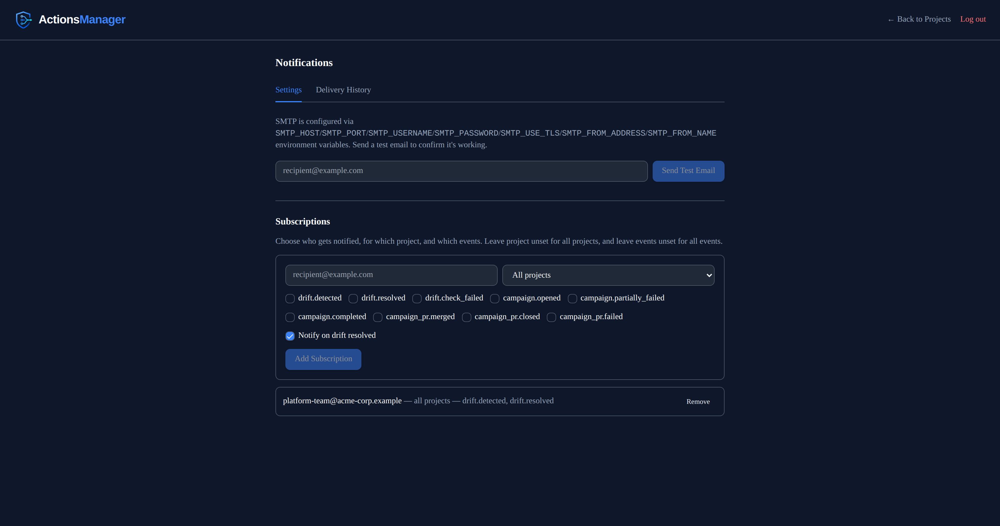

# Notifications
{: .no_toc }

Get emailed when a workflow drifts or a PR campaign needs attention, instead of checking the dashboard.
{: .fs-6 .fw-300 }

<details open markdown="block">
  <summary>Table of contents</summary>
  {: .text-delta }
1. TOC
{:toc}
</details>

---

## What Notifications Cover

ActionsManager can send email notifications for two kinds of events:

- **Workflow drift** — a workflow becomes drifted, is resolved, or a drift check fails (API/permission error)
- **PR campaigns** — a campaign opens, some pull requests fail to create, a campaign completes, or an individual PR merges/closes/fails

Notifications are sent only on **state changes**. Repeated scans that find the same unresolved drift, or repeated reads of an already-completed campaign, do not send duplicate emails.

## Configuring SMTP

SMTP is configured with environment variables — the same way every other self-hosted setting in ActionsManager works. There's no in-app SMTP form and no SMTP credentials stored in the database.

```
SMTP_HOST=smtp.example.com
SMTP_PORT=587
SMTP_USERNAME=your_smtp_username
SMTP_PASSWORD=your_smtp_password
SMTP_USE_TLS=true
SMTP_FROM_ADDRESS=notifications@yourcompany.com
SMTP_FROM_NAME=ActionsManager
```

`SMTP_HOST` and `SMTP_FROM_ADDRESS` are required; the rest have sensible defaults. See `.env.self-hosted.example` for the full reference.

From **Workspace menu → Notifications**, use **Send Test Email** to confirm the configuration works. Connection, TLS, and authentication failures are reported with their specific cause, not a generic error.



## Subscriptions

A subscription tells ActionsManager who to email, and about what:

- **Recipient** — the email address to notify
- **Project scope** — a specific project, or all projects
- **Events** — which event types to notify on (leave empty for all)
- **Notify on drift resolved** — whether resolution emails are sent in addition to detection emails

Workspace admins manage subscriptions from **Workspace menu → Notifications**.

## Delivery History

The same page shows recent delivery attempts: which event, which recipient, current status (`pending` / `sent` / `failed`), and the most recent failure reason if delivery hasn't succeeded yet. Failed deliveries are retried automatically with backoff and don't block drift checks or campaign operations.

## Event Reference

| Event | Meaning |
|---|---|
| `drift.detected` | A workflow transitioned from in-sync to drifted |
| `drift.resolved` | A drifted workflow returned to in-sync |
| `drift.check_failed` | A drift check failed (API or permission error) |
| `campaign.opened` | A PR campaign was created |
| `campaign.partially_failed` | Some repositories failed PR creation during an otherwise-successful campaign |
| `campaign.completed` | Every PR in a campaign is merged or closed |
| `campaign_pr.merged` | An individual campaign PR was merged |
| `campaign_pr.closed` | An individual campaign PR was closed without merging |
| `campaign_pr.failed` | An individual repository failed PR creation |

## Current Limitations

- Drift notification freshness follows the drift check cadence: projects are re-checked on a background schedule (every 15 minutes by default), so a drift introduced just after a check is notified on the next one. A project whose owner has no saved GitHub token isn't checked automatically at all, and so won't notify until someone runs **Check Now** — see [Drift Detection](#when-drift-is-checked).
- Editing an existing campaign (adding/removing repos, changing merge behavior, etc.) and explicitly closing a campaign don't have dedicated notification events yet, since ActionsManager doesn't have those actions today.
- Only email is supported. Slack, Microsoft Teams, and generic webhooks are not implemented.
