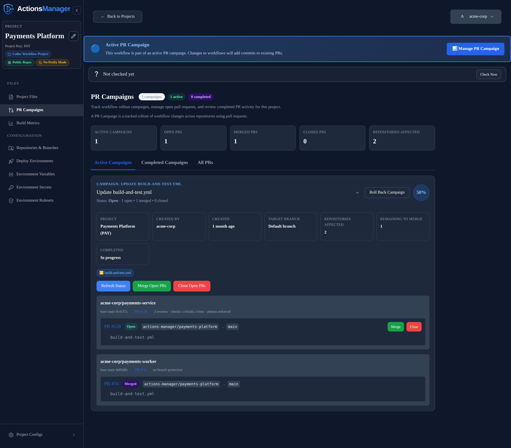
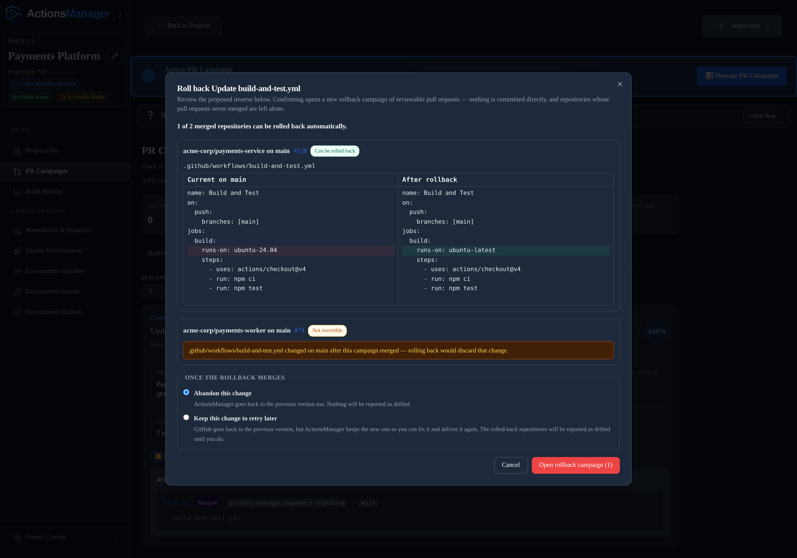

# PR Campaigns
{: .no_toc }

Roll out workflow changes across many repositories simultaneously through coordinated pull requests.
{: .fs-6 .fw-300 }

  
Table of contents

  {: .text-delta }
1. TOC
{:toc}

---

## What is a PR Campaign?

A **PR campaign** is a coordinated operation that opens a pull request in every repository in a project simultaneously. Instead of manually creating a pull request in each repository, ActionsManager creates them all in a single bulk action with consistent metadata.

PR campaigns are the recommended delivery method for rolling out workflow changes in a reviewable and auditable way.

## How a PR Campaign Works

1. **Define the change** — create or update a workflow in your project
2. **Start the campaign** — ActionsManager opens a pull request in each repository in scope
3. **Review and merge** — repository owners review the PRs individually, or you bulk-merge from ActionsManager
4. **Track progress** — the campaign dashboard shows which PRs are open, merged, or closed

## Creating a PR Campaign

1. Navigate to your project and select a workflow
2. Make your changes in the workflow editor
3. Choose **PR-based delivery**
4. Configure PR settings:
   - Branch name
   - PR title
   - PR description / commit message
5. Click **Create PRs**

ActionsManager creates a pull request in each repository using the configured GitHub token. All PRs share the same title, description, and branch name for consistency.

## Campaign Dashboard

The campaign dashboard shows:
- Total repositories in scope
- PRs opened, merged, closed
- Individual PR status per repository
- Links to each PR on GitHub

Each campaign card carries the completion percentage and, once anything has
merged, **Roll Back Campaign** in its header.

The tiles below the header describe the rollout itself:

| Tile | What it means |
|---|---|
| **Target branch** | The branch mode the project is configured with, not the branch it resolved to — `Default branch` means each repository is targeted on its own default, which may differ per repository. Hover to see the branches actually used. |
| **Repositories affected** | How many repositories opened a pull request. If a target opened none, this reads `2 of 3 targeted` so the shortfall is visible without counting rows. |
| **Remaining to merge** | Pull requests still open. |

### What was captured when the campaign was created

Under each repository name the card shows the state that repository was in at
the moment the campaign went out:

- **The base branch and commit** the pull request was cut from — `base main 9c41f7a`. The branch is named because a project on `Default branch` targets a different branch in each repository.
- **A link to the pull request** opened against that target.
- **The branch protection** in force at the time — required reviews and status checks, or `no branch protection`.

A repository that was targeted but never opened a pull request still appears,
marked `No PR opened`, rather than silently vanishing from the list.

## Bulk Operations

From the campaign dashboard you can:
- **Bulk merge** — merge all open PRs that have required checks passing
- **Bulk close** — close all open PRs without merging
- **Sync status** — refresh PR state from GitHub

## PR Metadata

ActionsManager adds consistent metadata to campaign PRs:
- Standardized branch names (e.g., `actions-manager/update-workflow`)
- Descriptive PR titles and bodies
- Labels for tracking and filtering

## Rolling a Campaign Back

Closing a campaign's still-open PRs is enough to stop a rollout that has not landed. Once PRs have merged, use **Roll Back Campaign** on the campaign card instead — it generates the inverse of the change and delivers it the same way the original went out.

1. **Preview** — ActionsManager reads each merged pull request on GitHub and works out what the repository looked like immediately before that PR merged. The proposed inverse is shown as a diff, per repository and per file, before anything is created.
2. **Say whether you are done with the change** — a rollback puts the old content back in GitHub while ActionsManager still holds the new content, so it asks which one you meant. Either:
   - **Abandon this change** — ActionsManager goes back to the previous version too, so nothing is reported as drifted; or
   - **Keep this change to retry later** — GitHub goes back to the previous version but ActionsManager keeps the new one, so you can fix it and deliver it again. [Drift detection]() reports the rolled-back repositories until you do.
3. **Confirm** — a new rollback campaign opens, made of ordinary reviewable pull requests. Nothing is committed directly.

The rollback campaign and the campaign it reverts each name the other on their cards.

### What can and cannot be inverted

Only repositories whose pull request actually merged become rollback targets. Repositories that never merged are left alone — close their PRs instead.

A repository is flagged **not invertible**, and no pull request is opened for it, when:

- a file the campaign touched has been changed, deleted, or re-added on the target branch since the campaign merged — reverting would discard that later change;
- the pull request's merge commit can no longer be read on GitHub, so the pre-campaign state is unknown;
- the campaign renamed a file, or touched something that is not a UTF-8 text file.

Flagged repositories stay visible in the preview with the reason, rather than being silently skipped. The inverse is recomputed when you confirm, so a repository that changed between preview and confirmation is reported as skipped rather than overwritten.

## Preflight Validation

Before a campaign can be created for critical changes, ActionsManager can run a **preflight validation** step — a validation PR that must be reviewed and merged before the full campaign proceeds. This ensures that the change is reviewed by at least one person before it is deployed across all repositories.

Preflight does not gate a rollback: it validates the change you are rolling *out* against a validation repository, which says nothing about reverting one. The inverse-diff review is a rollback's own gate.

## Related Topics

- [Workflows]() — manage workflow content
- [Projects]() — organize repositories into projects
- [Drift Detection]() — detect post-merge drift
