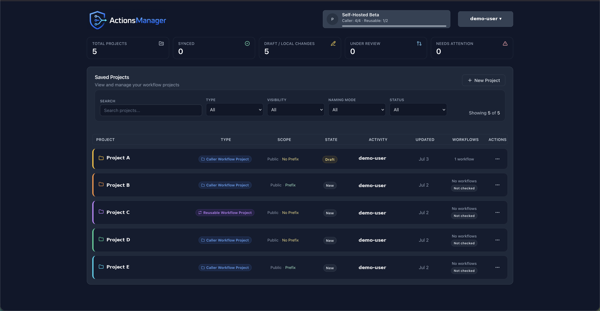

# Projects
{: .no_toc }

Projects are the primary organizational unit in ActionsManager, grouping related repositories for coordinated workflow management.
{: .fs-6 .fw-300 }

  
Table of contents

  {: .text-delta }
1. TOC
{:toc}

---

## What is a Project?

A **project** in ActionsManager is a named collection of repositories that share a workflow management scope. Projects are the unit you operate on — permissions, workflows, secrets, and rollouts are all coordinated at the project level.

Instead of managing workflows repository by repository, you group related repositories into a project and apply changes to all of them in a single operation.

## Project Types

ActionsManager uses two project types that reflect the two sides of GitHub Actions reusability:

### Caller Workflow Project

A **Caller Workflow Project** (referred to internally as `standard`) manages the repositories whose workflows *call* reusable workflows using the `uses:` directive.

Use this project type when you want to:
- Manage multiple repositories that share a common workflow pattern
- Apply, update, or remove caller workflows across a fleet of repositories
- Keep all repositories synchronized against a shared workflow definition

### Reusable Workflow Project

A **Reusable Workflow Project** (referred to internally as `rwx`) manages the *producer* side — the repository that defines and publishes the reusable workflows that other repositories call.

Use this project type when you want to:
- Author and version reusable workflow definitions centrally
- Track which caller workflows across your organization reference your reusable workflows
- Propagate changes from the producer to all consumers

### Working Together

The real power of ActionsManager comes from managing both project types together. When a reusable workflow changes in a producer project, ActionsManager identifies which caller projects are affected and can roll out the update across the entire consumer fleet.

## Creating a Project

1. Click **New Project** in the dashboard
2. Choose a project type (Caller Workflow or Reusable Workflow)
3. Name the project
4. Add repositories to the project

## Managing Repositories

Within a project you can:
- **Add repositories** — include repositories from your GitHub account or organizations
- **Remove repositories** — take a repository out of scope without deleting its workflows
- **Configure per-repository settings** — specify branches, labels, and delivery preferences

## Project Permissions

Access to a project is tied to your GitHub authentication. You can only manage repositories that your configured GitHub token or OAuth session can access.

## Related Topics

- [Workflows]() — manage workflow content across project repositories
- [PR Campaigns]() — roll out changes through reviewable pull requests
- [Drift Detection]() — detect when repositories diverge from the managed state
- [Reusable Workflows]() — manage producer-consumer workflow relationships
