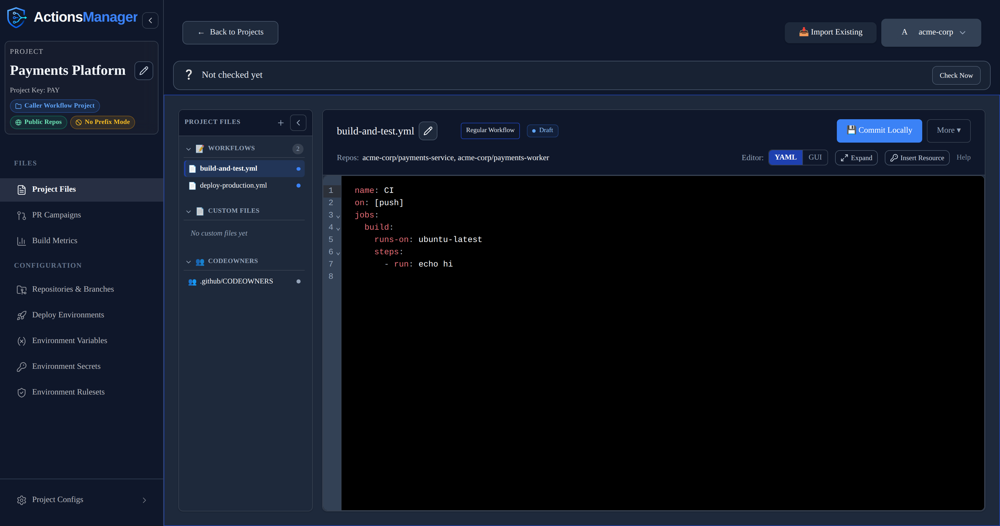
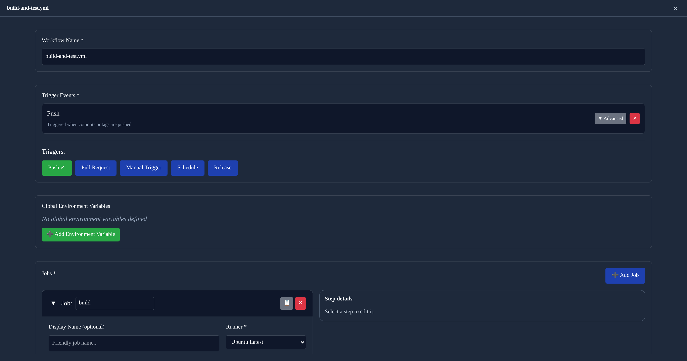

# Workflows
{: .no_toc }

Manage GitHub Actions workflow files across all repositories in a project from a single interface.
{: .fs-6 .fw-300 }

  
Table of contents

  {: .text-delta }
1. TOC
{:toc}

---

## Overview

ActionsManager treats workflow management as a fleet operation, not a per-repository task. When you define or update a workflow in a project, ActionsManager tracks every repository that should have that workflow and what state it should be in.

## Workflow Operations

### Applying a Workflow

**Applying** a workflow pushes the managed workflow definition to the `.github/workflows/` directory of each repository in the project. You can deliver the change via:

- **PR-based delivery** — opens a pull request in each repository for review before merging
- **Direct commit** — commits the change directly to the target branch (use carefully)

See [PR Campaigns]() for PR-based delivery.

### Updating a Workflow

When you edit a workflow definition in ActionsManager, the platform:
1. Updates the managed workflow content
2. Identifies which repositories in the project are affected
3. Delivers the updated workflow via your configured delivery method

### Removing a Workflow

Removing a workflow from a project scope deletes the `.github/workflows/` file from all repositories in the project, again via PR or direct commit.

## Workflow Status

Every workflow carries a status showing how far it has travelled from ActionsManager to GitHub:

| Status | Meaning |
|--------|---------|
| **New Local** | Created in ActionsManager, never delivered |
| **Committed Locally** | Edited and saved in ActionsManager, not yet delivered to GitHub |
| **Under Review** | Carried by an open pull request that hasn't merged yet |
| **Synced** | Delivered, and the repository's file matches the managed definition |

Lists may also show derived labels that combine the status with what's actually in GitHub: **Local
Draft** and **Pending Sync** for content with no GitHub baseline yet, **Imported Locally** for a
workflow imported from a repository but not yet re-delivered, and **Drift Detected** when the file in
GitHub has diverged.

Status and drift answer different questions. Status is about *your* pending work; drift is about
changes made in GitHub outside ActionsManager. A workflow that is Committed Locally or Under Review
is never reported as drifted — see [What Counts as Drift](#what-counts-as-drift).

## Workflow Names Across Projects

Workflow names only need to be unique **within** a project. Two projects can each have a workflow
called `ci`, and they are entirely independent — editing or syncing one never affects the other.

Each workflow belongs to exactly one project. Sharing a single workflow between projects is not
supported; if two projects need the same content, give each its own copy, or use a
[Reusable Workflow Project](), which is the supported way
to share definitions.

**Prefix mode affects only the GitHub filename.** With prefixing on, project `ABC` pushes
`AM_ABC_ci.yml` so two projects' files never collide in a shared repository. It does not change the
name ActionsManager stores, which is always the bare `ci`.

## Delivery Modes

| Mode | Description | When to Use |
|------|-------------|-------------|
| PR-based | Opens a PR in each repository | Recommended for most changes; enables review |
| Direct commit | Commits directly to the target branch | Fast delivery when review is not required |

{: .note }
PR-based delivery is recommended for beta testing and production use. Direct commit mode should be used carefully — changes cannot be reviewed before taking effect.

## Build Detection

ActionsManager can inspect a repository's codebase to detect what build tooling it uses, then recommend matching workflow templates. Detected build types include:

- Maven, Gradle (Java/Kotlin)
- npm, Yarn (JavaScript/TypeScript)
- .NET (C#, F#)
- Python (pip, Poetry, pipenv)
- Go
- Rust (cargo)
- Docker

See [Build Detection]() for complete details on supported build types, detection patterns, and suggested workflow templates.

## Workflow Editor

ActionsManager includes a YAML editor for creating and modifying workflow content directly in the interface. The editor provides:
- Syntax highlighting
- YAML validation
- Template selection
- Insertion of existing project secrets, variables and deployment environments

Use **YAML** or **GUI** in the editor toolbar to switch between the two views of the same workflow.

### Expanding the editor

**Expand**, next to the editor switch, opens the current workflow on a full-screen surface. It's available in both YAML and GUI mode, so it stays in the same place whichever view you're in — GUI mode gains the most, since the job list and step panel are no longer sharing an already-narrow pane.

The expanded view will not close by accident. Clicking outside it does nothing, and there is no backdrop to dismiss — you leave it with the **✕** in its header, or by pressing <kbd>Esc</kbd>. If the workflow has unsaved changes you're asked to confirm first, and confirming only collapses the view: your changes stay in the editor, still marked **Unsaved**, and nothing is committed or discarded.

Everything the toolbar offers for the current mode comes with you. In YAML mode that includes **Insert Resource**, so secrets, variables and deployment environments are still one click away.

### GUI mode

Switching the editor to **GUI** mode gives you a form-based view of the same workflow, kept in sync with the YAML as you edit.

**Triggers** are toggle buttons. Clicking one adds that trigger with sensible defaults; clicking it again removes it, along with any branches, paths, sub-types or cron schedule you set on it. A trigger can only be added once — GitHub Actions keys `on:` by event name, so a second copy could never survive being written out.

**Steps** are listed as compact rows. Click a row to open that step in the detail panel, which stays open while you move between steps — it sits to the right of the job list, or below it on narrower screens, where selecting a step scrolls it into view. The panel is the only place a step is edited, so there's never a question of where to make a change. Renaming a step updates its row title immediately.

Adding or duplicating a step opens it in the panel straight away, ready to edit.

### Inserting secrets and variables

The secrets, variables and deployment environments you create under **Repository Configs** can be referenced from the editor without typing their names by hand.

In YAML mode, **Insert Resource** in the editor toolbar opens a searchable list grouped by type, with the repository each entry belongs to shown beside it. Choosing one writes the reference at the cursor:



| Resource | Inserted |
|---|---|
| Secret | `${{ secrets.NAME }}` |
| Variable | `${{ vars.NAME }}` |
| Deployment environment | `environment: NAME` |

Typing `${{` in the editor offers the same secrets and variables as inline suggestions.



In GUI mode the same picker sits beside the free-text fields — a step's **Script**, its environment variable values, and action parameter values — and inserts at the cursor in that field. Deployment environments are not offered there: `environment:` is a job-level key, so it only makes sense in the YAML document.

This matters most in **Prefix Mode**, where the name stored in GitHub carries the project prefix. A secret you created as `DOCKER_PASSWORD` in project `REG1` is stored as `AM_REG1_DOCKER_PASSWORD`, and that full name is what a workflow has to reference. The picker inserts exactly the name GitHub holds, so the prefix is never something you have to remember or get right by hand.

Two things worth knowing:

- **Secret values are never shown.** GitHub does not return stored secret values, and ActionsManager only ever displays and inserts names. The same applies to variables — the picker lists names only.
- **Inserting does not save.** The workflow is marked **Unsaved** and nothing is written until you commit it, so an insertion can always be undone or edited first.

The picker is not offered when you have read-only access to the project, or while a workflow is locked for review.

## Related Topics

- [Projects]() — organize repositories for workflow management
- [PR Campaigns]() — deliver changes through reviewable pull requests
- [Drift Detection]() — monitor workflow consistency
- [Reusable Workflows]() — manage reusable workflow producers
