# First Workflow Walkthrough
{: .no_toc }

A screenshot walkthrough of the happy path for first-time Self-Hosted Beta users — from PAT sign-in to saving your first local workflow draft.
{: .fs-6 .fw-300 }

  
Table of contents

  {: .text-delta }
1. TOC
{:toc}

---

> **Beta notice:** ActionsManager Self-Hosted is currently a free beta preview. No paid plans are currently available. The beta is provided as-is, without warranty or production-readiness guarantee.

## Overview

This walkthrough covers the end-to-end happy path for a first-time self-hosted beta user:

1. Open the login screen
2. Enter your Personal Access Token and sign in
3. Meet the welcome screen and choose whether to take the guided tour
4. View the empty Saved Projects dashboard
5. Create a new project — Project Basics
6. Create a new project — Select Repositories
7. Create a new project — Review and confirm
8. View the updated dashboard with your new project
9. Open the project workspace
10. Add your first workflow from the workspace
11. Choose the workflow type
12. Configure Regular Workflow options
13. Review and edit workflow YAML in the editor
14. Confirm the save-draft prompt
15. View the saved draft state

**Important:** Saving a draft does **not** push any changes to GitHub. A saved draft exists only in ActionsManager until you create pull requests. PR-based delivery is the recommended path during beta testing.

---

## Step 1 — Open the Login Screen

Open `http://localhost:8080` after starting the container. The login screen offers two authentication methods: **Sign in with GitHub** (OAuth) and **Sign in with Personal Access Token**.

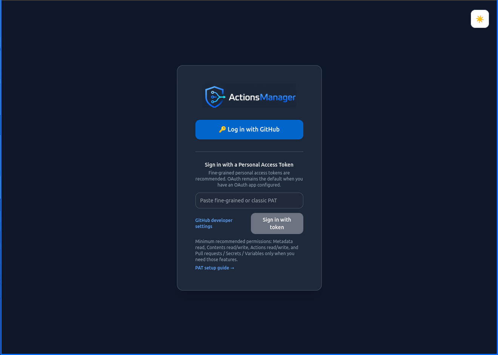

For the fastest self-hosted beta path, choose **Sign in with Personal Access Token** and paste a fine-grained or classic GitHub PAT into the token field.

{: .warning }
Never include a personal PAT in Docker command lines, shell history, environment files, GitHub issues, or screenshots. Enter the token in the UI after the container starts. See [GitHub PAT Setup]() for recommended permissions.

---

## Step 2 — Enter Your PAT and Sign In

Paste your PAT into the token field. The field will show the token ready for submission.

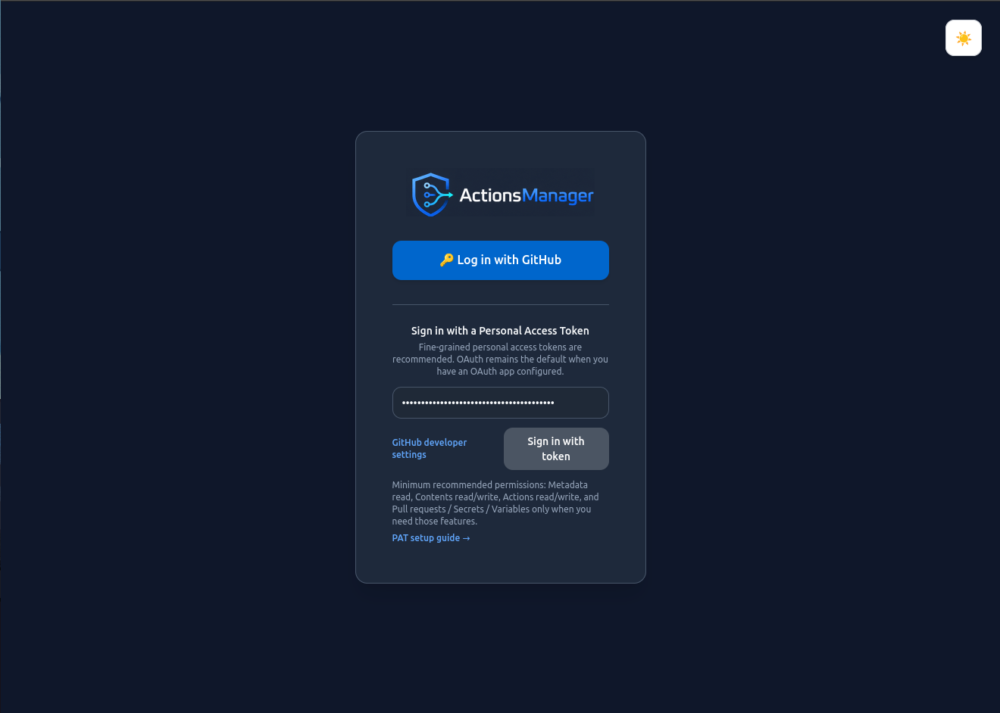

Click **Sign In** to authenticate.

---

## Step 3 — Welcome Screen and the Guided Tour

The first time you sign in, ActionsManager introduces itself before you reach the dashboard. The welcome screen explains what the product does in three points: projects group repositories, changes are delivered as pull requests, and drift detection tells you when a repository has diverged from the workflow you expect.

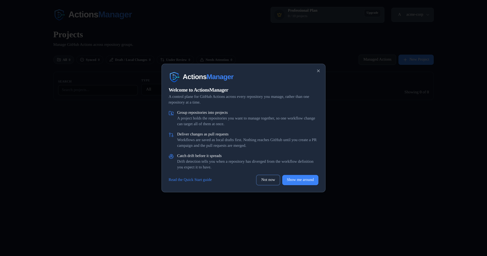

You have two choices:

- **Not now** — dismisses the welcome screen and takes you straight to the dashboard. It will not appear again.
- **Show me around** — starts a guided tour that walks you through this entire walkthrough inside the product.

Either way you can carry on with the steps below. The rest of this page documents the flow without the tour running.

### What the guided tour does

The tour highlights the control you need next and explains the choice in front of you, one step at a time. It waits for you to actually perform each action — it never clicks anything on your behalf, because from the pull request step onward those are real changes to your repositories.

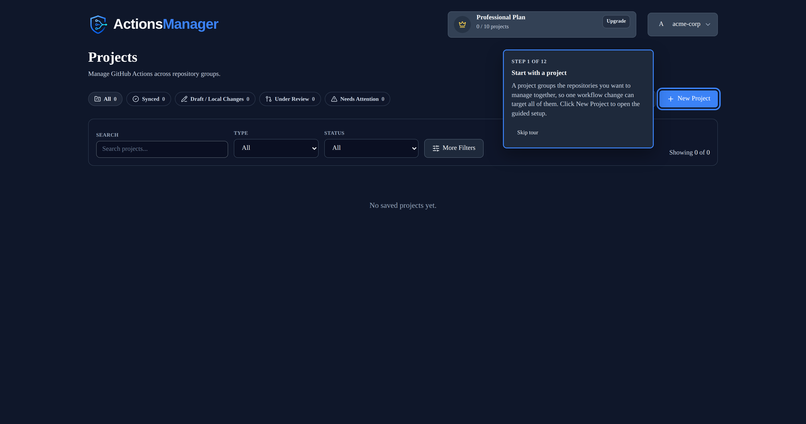

While the tour runs it also fills in the Create Project form for you — a demo project name, a colour, and Prefix Mode — so you can read each explanation rather than inventing values. You can change any of them.

The tour is not modal: the rest of the app stays usable while it is on screen. Press **Skip tour**, or the Escape key, to end it at any point without losing work.

You can start it again later from **Restart tour** in the user menu (top right).

> **Note:** the welcome screen and tour are only offered to members who can create projects. If your workspace administrator has given you read-only access, you will go straight to the dashboard.

---

## Step 4 — Saved Projects Dashboard

After signing in you land on the **Saved Projects** dashboard. The header shows beta usage limits (for example, 4 Caller Workflow Projects and 2 Reusable Workflow Projects in the Self-Hosted Beta). The project list is empty until you create your first project.

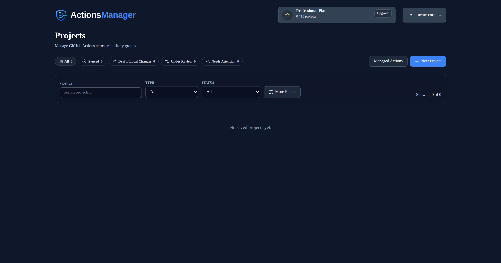

Click **New Project** to begin.

---

## Step 5 — Create Project: Project Basics

The **Create Project** wizard opens on the **Project Basics** step. Enter a project name, choose the project type, and pick an identity color.

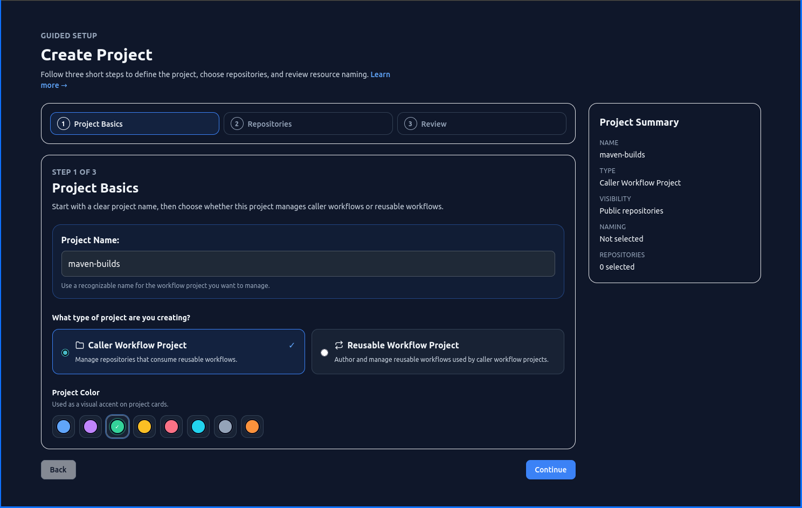

| Option | Description |
|--------|-------------|
| **Caller Workflow Project** | Manages repositories whose workflows call reusable workflows. This is the most common starting point. |
| **Reusable Workflow Project** | Manages a shared workflow producer repository. |

Choose **Caller Workflow Project** for a typical first project and click **Next**.

---

## Step 6 — Create Project: Select Repositories

Select whether the project covers **public** or **private** repositories, then pick one or more repositories from the list. A summary of selected repositories is shown before you continue.

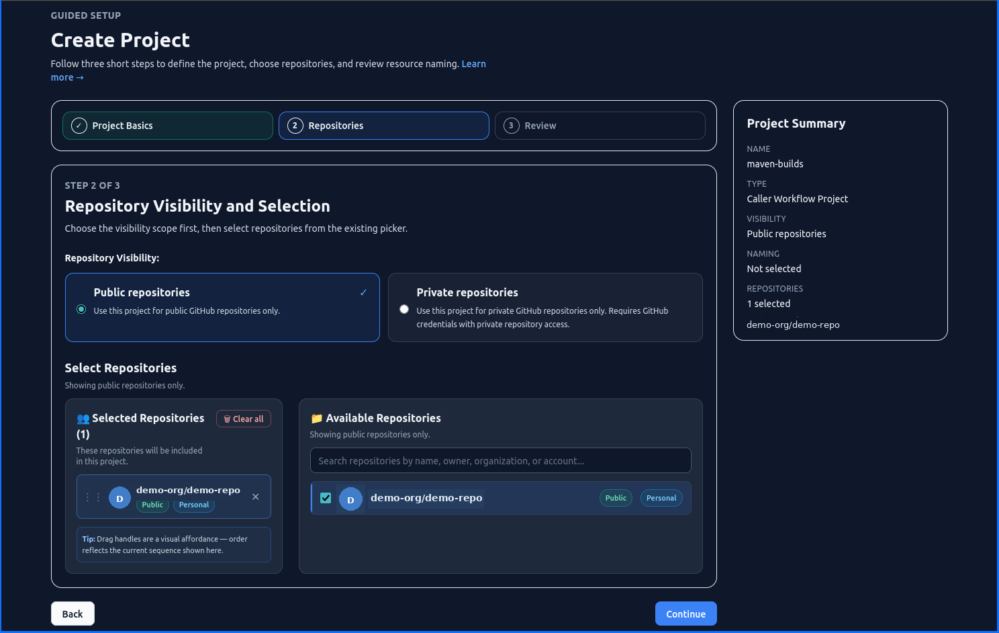

Click **Next** when all target repositories are selected.

### Trying it on a throwaway repository

If you would rather not point your first project at a repository you care about — the walkthrough ends with a real pull request — use **Create a demo repository**. It creates a repository named `actionsmanager-demo` under your account and selects it for you.

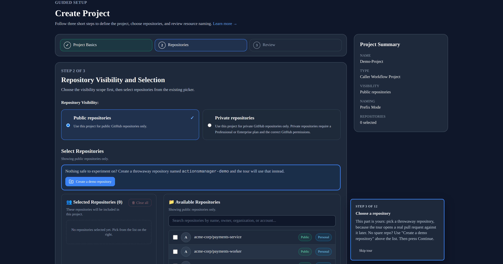

This option appears while the guided tour is running.

---

## Step 7 — Create Project: Review and Confirm

Review the project summary before creation. This step also shows the **Prefix Mode** option.

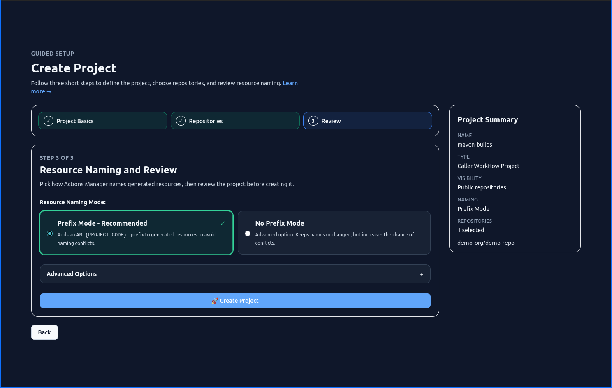

{: .note }
**Prefix Mode** is enabled by default. It prefixes generated workflow filenames with a project-specific identifier, making it easy to distinguish ActionsManager-managed workflows from manually created ones. Keep Prefix Mode enabled unless you intentionally want unmanaged names.

Confirm the project name, type, repositories, and prefix setting, then click **Create Project**.

---

## Step 8 — Projects Dashboard After Creation

After creating the project, you are returned to the **Saved Projects** dashboard. Your new project now appears in the project list with its identity color and type badge.

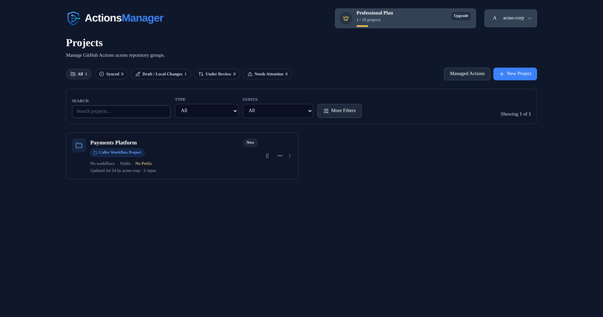

Click the project card to open the project workspace.

---

## Step 9 — Project Workspace: Overview

The project workspace opens with an empty workflow state. The left sidebar shows the project and its repositories.

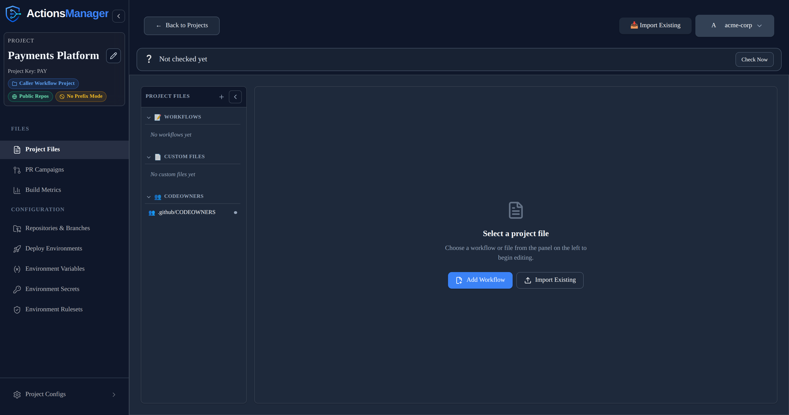

---

## Step 10 — Project Workspace: Add Your First Workflow

The main area shows three action buttons: **Import Existing**, **Create Pull Requests**, and **Add Workflow**.

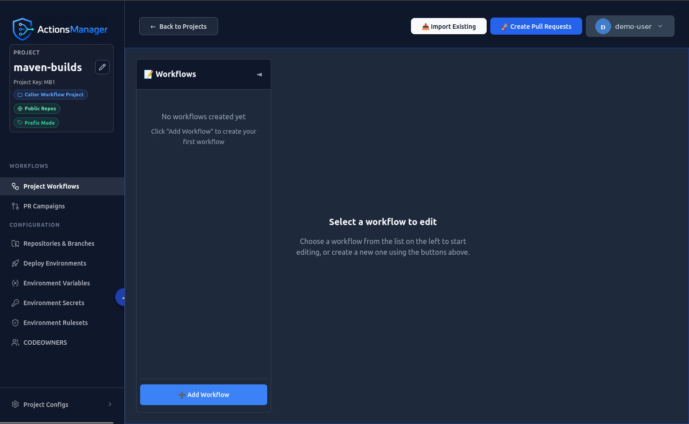

Click **Add Workflow** to create your first workflow.

---

## Step 11 — Create New Workflow: Choose Type

The **Create New Workflow** modal presents three workflow type options:

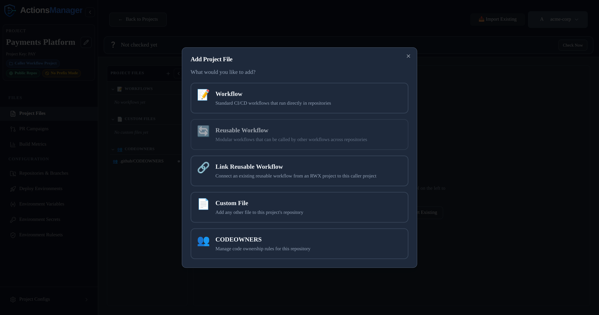

| Option | Description |
|--------|-------------|
| **Regular Workflow** | A standard GitHub Actions workflow file for one or more repositories in the project. |
| **Reusable Workflow** | A workflow defined once and called from other workflows. Available for Reusable Workflow Projects. |
| **Link Reusable Workflow** | Links this project's caller workflows to an existing reusable workflow in another project. |

Choose **Regular Workflow** for a first workflow and click **Next**.

---

## Step 12 — Regular Workflow Options

Enter a workflow name and choose how to create the initial YAML content:

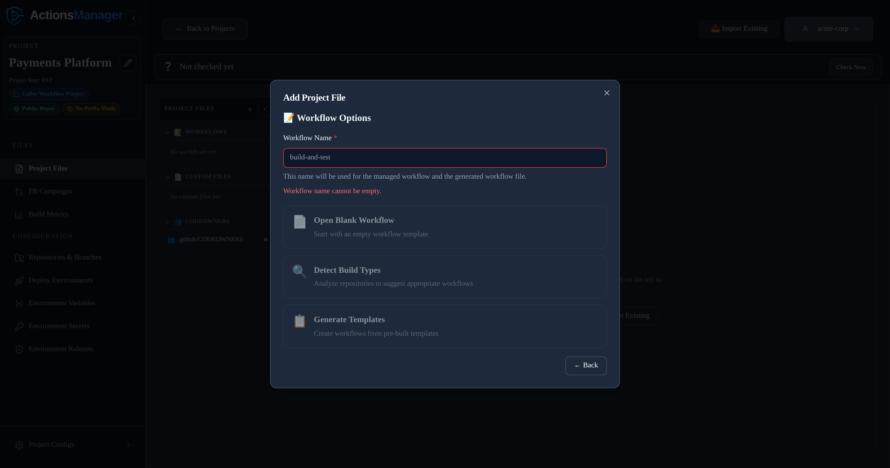

| Option | Description |
|--------|-------------|
| **Open Blank Workflow** | Starts with an empty YAML editor. |
| **Detect Build Types** | Inspects the selected repositories and recommends matching workflow templates based on detected build tooling (Maven, npm, .NET, Python, Go, Rust, Docker, etc.). |
| **Generate Templates** | Presents a library of curated workflow templates. |

Enter a workflow name, choose an option, and click **Create**.

---

## Step 13 — Workflow Editor

The workflow editor opens with the new workflow file. The header shows the generated filename (with prefix if Prefix Mode is enabled), the selected repository, and the current save state (**Unsaved**).

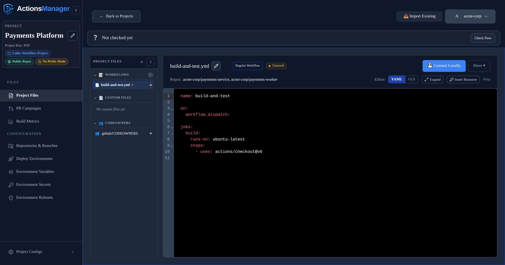

Review and edit the YAML as needed. When the workflow is ready to save locally, click **Commit Locally**.

---

## Step 14 — Saved Draft State

After clicking **Commit Locally**, the workflow is saved immediately. The editor shows the **New Local** status badge and a toast notification confirms the workflow was saved as a draft.

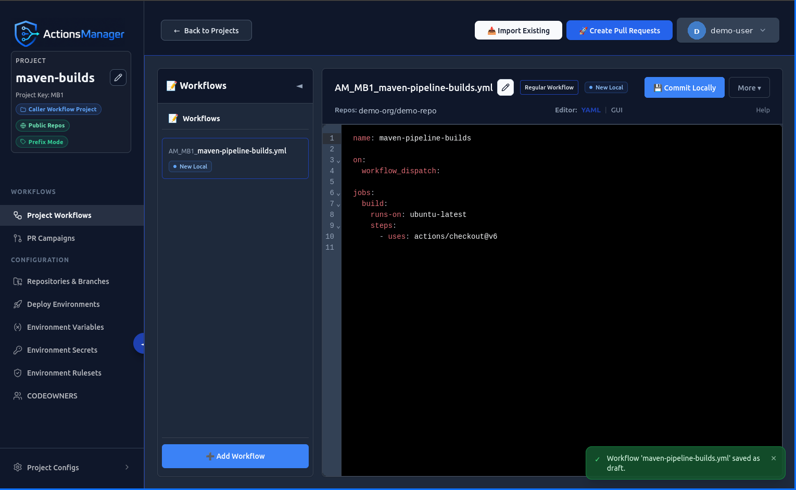

{: .note }
Saving a draft stores the workflow in ActionsManager only. It does **not** commit to a repository or push to GitHub. This is intentional — it lets you review and refine workflows before proposing changes through pull requests.

The workflow now exists as a local draft in ActionsManager. No changes have been made to any repository yet.

---

## What Happens Next

| Action | Effect |
|--------|--------|
| **Create Pull Requests** | Proposes the draft workflow to GitHub repositories as reviewable pull requests. Recommended for beta testing. |
| **Continue editing** | Update the YAML and save additional drafts before creating pull requests. |
| **Direct commit** | Commits directly to the repository branch without a pull request. Use carefully. |

Return to the project workspace and click **Create Pull Requests** when you are ready to send the workflow to GitHub.

---

## Important Notes

### Saving a draft is not the same as pushing to GitHub

A **Save draft / Commit Locally** action stores the workflow in ActionsManager only. The workflow file does not appear in any repository until you explicitly create a pull request or use direct commit mode. Both are separate steps after drafting.

### PR-based delivery is recommended for beta testing

Pull request delivery lets you review each change before it merges. This is the safest path during beta. Direct commit mode is available but bypasses review; use it only when review overhead is not needed and the change is well understood.

### Recommended PAT permissions

When creating a fine-grained PAT for ActionsManager, grant these permissions to cover all features used in this walkthrough:

| Permission | Minimum Level | Required for |
|-----------|--------------|-------------|
| Metadata | Read-only | All operations |
| Contents | Read and write | Workflow file management |
| Actions | Read and write | Workflow triggering |
| Pull requests | Read and write | PR-based delivery |
| Secrets | Read and write | Repository secrets management (optional) |
| Variables | Read and write | Repository variables management (optional) |

Secrets and Variables permissions are only needed if you use those features. For a basic first-workflow walkthrough, Metadata, Contents, Actions, and Pull requests are sufficient.

See [GitHub PAT Setup]() for full token creation instructions.

---

## Related Topics

- [Quick Start]() — start the container and sign in
- [GitHub PAT Setup]() — create and configure a PAT
- [Projects]() — understand the project model
- [Workflows]() — workflow management features
- [PR Campaigns]() — deliver changes through pull requests
- [Drift Detection]() — keep repositories in sync
