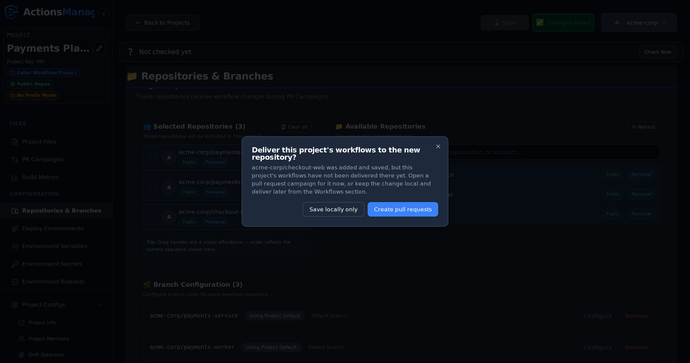

Projects are the primary organizational unit in ActionsManager, grouping related repositories for coordinated workflow management.

---

## What is a Project?

A **project** in ActionsManager is a named collection of repositories that share a workflow management scope. Projects are the unit you operate on — permissions, workflows, secrets, and rollouts are all coordinated at the project level.

Instead of managing workflows repository by repository, you group related repositories into a project and apply changes to all of them in a single operation.

## Project Types

ActionsManager uses two project types that reflect the two sides of GitHub Actions reusability:

### Caller Workflow Project

A **Caller Workflow Project** (referred to internally as `standard`) manages the repositories whose workflows *call* reusable workflows using the `uses:` directive.

Use this project type when you want to:
- Manage multiple repositories that share a common workflow pattern
- Apply, update, or remove caller workflows across a fleet of repositories
- Keep all repositories synchronized against a shared workflow definition

### Reusable Workflow Project

A **Reusable Workflow Project** (referred to internally as `rwx`) manages the *producer* side — the repository that defines and publishes the reusable workflows that other repositories call.

Use this project type when you want to:
- Author and version reusable workflow definitions centrally
- Track which caller workflows across your organization reference your reusable workflows
- Propagate changes from the producer to all consumers

### Working Together

The real power of ActionsManager comes from managing both project types together. When a reusable workflow changes in a producer project, ActionsManager identifies which caller projects are affected and can roll out the update across the entire consumer fleet.

## Creating a Project

1. Click **New Project** in the dashboard
2. Choose a project type (Caller Workflow or Reusable Workflow)
3. Name the project
4. Add repositories to the project

## Managing Repositories

Within a project you can:
- **Add repositories** — include repositories from your GitHub account or organizations
- **Remove repositories** — take a repository out of scope without deleting its workflows
- **Configure per-repository settings** — specify branches, labels, and delivery preferences

### Adding a Repository to a Project That Already Has Workflows

Adding a repository does not push anything to it. The repository joins the project's scope, but
the project's existing workflows are not in it yet — and because nothing has ever been delivered
there, it is [not reported as drift](drift-detection.html#what-counts-as-drift)
either. Without a prompt, a newly added repository could sit empty indefinitely with nothing
saying so.

So when you press **Save** in **Repositories & Branches** having added one or more repositories,
ActionsManager asks how to apply the project's workflows to them:

| Choice | What happens |
|--------|--------------|
| **Save locally only** | Nothing is pushed. The repository stays in the project, and no drift is reported. Deliver whenever you're ready from the Workflows section. |
| **Create pull requests** | Opens a [PR campaign](pr-campaigns.html) limited to the repositories you just added. Every workflow in the project is pre-selected, because the new repository has none of them. |

Dismissing the prompt is the same as choosing **Save locally only** — the repository was already
saved before the prompt appeared, so nothing is lost either way.

### Keeping Track of What's Still Waiting

Choosing **Save locally only** is not the end of the story, so ActionsManager keeps a standing
reminder until the workflows land. It appears in three places, each a different level of detail:

- **A count beside Repositories & Branches** in the sidebar, so the reminder is reachable from
  anywhere in the project.
- **A note at the top of the project**, next to the drift status row, naming the repositories and
  offering to open the pull requests.
- **A "Not delivered yet" badge** on each waiting repository in the Selected Repositories list.

None of it is styled as a warning, because nothing is wrong — the repository simply hasn't received
the files yet. All three clear themselves: opening a pull request pauses the reminder while it is in
review, and merging it removes the repository from the list for good.

The reminder only appears for repositories ActionsManager has genuinely never delivered to. It stays
quiet on a project that has never been [drift-checked](drift-detection.html),
because until the first check there is no evidence either way, and guessing would mean telling you
that repositories you delivered to months ago are still waiting.

Two things the campaign does *not* carry:

- **Custom files that are already synced elsewhere.** A campaign only offers custom files with
  pending changes, so a file already delivered to the project's other repositories is not
  automatically copied to the new one. Edit it to include it in a campaign.
- **Reusable workflow definitions.** Those live in the producer repository, not in the caller
  repositories, so a new caller repository does not need them pushed to it.

Removing a repository never prompts — there is nothing to deliver.

## Branch Configuration

**Repositories & Branches** decides which branches a project writes to. The same answer is used for
[drift detection](drift-detection.html#which-branches-are-checked), so a project is
always compared against the branches it actually delivers to — never against a branch nobody chose.

| Option | What it targets |
|--------|-----------------|
| **Default branch** | Each repository's own GitHub default branch |
| **Branch name or pattern** | Every branch matching the name or regular expression you enter (`main`, `release-.*`, `feature/auth`) |

Pattern mode adds a **Max branch age** (1–30 days, 30 by default): only branches with a commit
inside that window are targeted, so stale branches matching the pattern are left alone. If a pattern
matches nothing — or every match is older than the window — ActionsManager falls back to the
repository's default branch.

**Per-repository override.** Each repository in the list either uses **Use project default** or
**Override for this repository**, which gives that one repository its own option, pattern and age
window. Everything else in the project keeps the project setting.

## Ordering Projects

The Projects dashboard keeps the arrangement you choose. Drag a card by its grip
handle (to the left of the three-dot menu) and drop it anywhere in the grid.

- **Opening or editing a project no longer moves its card.** The dashboard used to
  sort by last-updated time, so simply viewing a project pushed it to the front.
- **Your order is your own.** It is saved per user, so rearranging your dashboard
  never changes what a teammate sees.
- **It follows you.** The order persists across refreshes, sessions, browsers and
  devices, because it is stored on the server rather than in the browser.
- **New projects appear at the end**, so an existing arrangement is never disturbed.
- **Reordering is disabled while searching or filtering.** A filtered grid only shows
  some of your projects, and saving from that view would lose the position of the
  hidden ones. Clear the filters to re-enable the handles — your full order is
  preserved while filtering.

Dragging never opens a project: clicking a card still navigates, and the three-dot
menu keeps working as before. If an order fails to save, the grid returns to its
previous arrangement and shows an error rather than leaving the dashboard and the
server out of step.

The first time you open the dashboard, projects are arranged most-recently-updated
first and that arrangement is saved as your starting point.

## Project Permissions

Access to a project is tied to your GitHub authentication. You can only manage repositories that your configured GitHub token or OAuth session can access.

### Renaming a Project

A project's display name is editable in place from the project sidebar. The project
code is not — it is fixed at creation, and the workflow filenames delivered in
[prefix mode](workflows.html#workflow-names-across-projects) are
built from it, so a project rename never renames or rewrites a managed file.

It is not completely invisible to your repositories, though. ActionsManager writes the
project name into each campaign pull request's description, as a link back to the
project's PR Campaigns view. Pull requests opened before the rename keep the old name,
and their link no longer resolves; pull requests opened after it carry the new one.
Rename between campaigns if that matters to your reviewers.

Renaming a project requires **editor** access to it. Project viewers can open the
project and read it, but the rename is rejected. Project owners and workspace admins
always qualify.

## Related Topics

- [Workflows](workflows.html) — manage workflow content across project repositories
- [PR Campaigns](pr-campaigns.html) — roll out changes through reviewable pull requests
- [Drift Detection](drift-detection.html) — detect when repositories diverge from the managed state
- [Reusable Workflows](reusable-workflows.html) — manage producer-consumer workflow relationships
