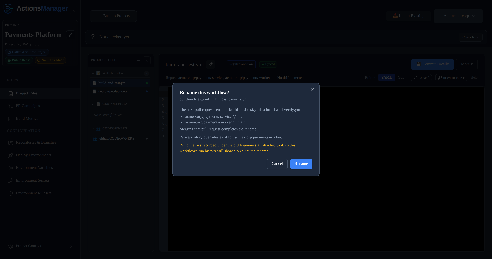
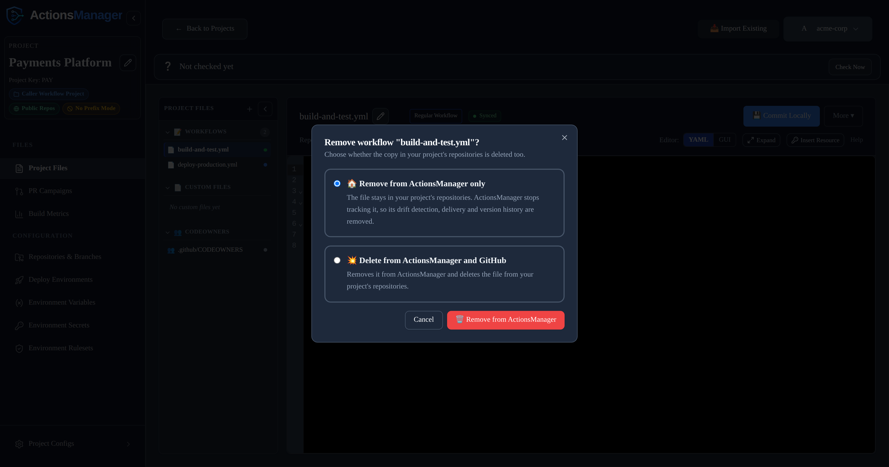
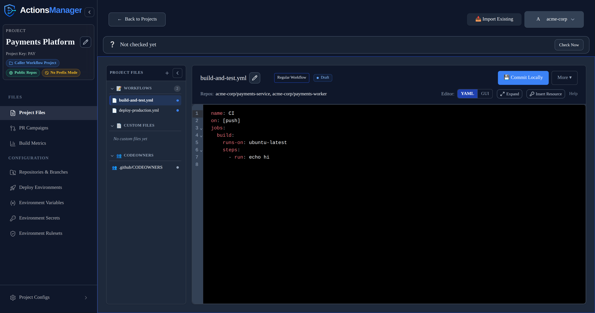

Manage GitHub Actions workflow files across all repositories in a project from a single interface.

---

## Overview

ActionsManager treats workflow management as a fleet operation, not a per-repository task. When you define or update a workflow in a project, ActionsManager tracks every repository that should have that workflow and what state it should be in.

## Workflow Operations

### Applying a Workflow

**Applying** a workflow pushes the managed workflow definition to the `.github/workflows/` directory of each repository in the project. You can deliver the change via:

- **PR-based delivery** — opens a pull request in each repository for review before merging
- **Direct commit** — commits the change directly to the target branch (use carefully)

See [PR Campaigns](pr-campaigns.html) for PR-based delivery.

### Updating a Workflow

When you edit a workflow definition in ActionsManager, the platform:
1. Updates the managed workflow content
2. Identifies which repositories in the project are affected
3. Delivers the updated workflow via your configured delivery method

Saving a workflow requires **editor** access to the project. Project viewers can open
a workflow and read its YAML, but the save is rejected. Project owners and workspace
admins always qualify. See [Permissions](permissions.html) for who
gets editor access and how it is granted.

### Renaming a Workflow

Rename a workflow from the filename field at the top of the editor: select the edit
control beside the name, type the new one, and save. You always edit the bare stem —
`.yml` is a locked segment to the right of the field in both naming modes, and in
prefix mode the project prefix is locked to the left of it. Typing the extension
yourself is harmless; it is stripped.

The edit control is disabled outright, rather than refusing later, for a workflow that
cannot be renamed here at all:

- A **linked** reusable workflow is named by the Reusable Workflow Project that owns
  it. Rename it there.
- A workflow **Under Review** is locked while its pull request is open. Unlock it from
  the pull request, or merge or close it.

Renaming changes the filename the workflow is *delivered* under, so ActionsManager
shows what the rename would do before it takes the new name.

The dialog reports:

- **Where the rename lands** — every repository and branch that currently holds the
  file under its old name, as `repo @ branch`. Merging the next pull request completes
  the rename in those places.
- **Caller workflows that reference it by filename** — listed by project and workflow
  name. ActionsManager does **not** rewrite a caller's `uses:` line; that is yours to
  update.
- **Per-repository overrides** that exist for the workflow, by repository.
- **Build metrics break at the rename** — shown on every rename. Runs recorded under
  the old filename stay attached to it, so the workflow's
  [Build Metrics](build-metrics.html) history starts fresh under the
  new name. This is the one consequence of a rename that cannot be undone by renaming
  back.
- **An overwrite warning**, in no-prefix projects only, when a file already sits at
  the new name in a repository and ActionsManager did not put it there. Delivering
  would overwrite it.

A repository the check could not read is still listed, marked *(could not be checked)*
— so the list is where the rename *may* land, not a confirmed inventory. When the
check reaches nothing at all, the dialog can say nothing has been delivered while also
warning that the list may be incomplete; read the two together and re-run the rename
once GitHub is reachable rather than trusting the first line.

If the impact check itself fails outright, renaming is still safe to attempt: the save
enforces the refusals below either way, and the next pull request still carries the
rename. What you lose is the list of repositories it will touch.

Confirming the dialog *is* the commit. Having agreed to what the rename does, you do
not then press **Commit Locally** for it to be saved.

#### The rename is delivered as a rename

Both halves of the rename ride one campaign branch: the file is written at its new
path and removed from the old one in the same pull request. The pull request reads as
a rename, and merging it completes the change in one step.

:::caution
Earlier releases did not remove the old file — a rename left it behind and you were
told to delete it yourself. Those orphans are still in your repositories under their
pre-rename names, and ActionsManager cannot clean them up retroactively: it no longer
knows what the old name was. Delete them by hand if you want them gone.
:::

#### When a rename is refused

Some renames cannot be performed safely, and ActionsManager refuses them rather than
leaving the result half-applied. The dialog names the reason and offers no **Rename**
button, and the save rejects the same cases with the same reason if something renames
anyway — with one exception, noted in the table: a capitalisation-only change is
refused by the dialog, but the save keeps the old casing and reports success rather
than failing, because raising there would abandon a multi-workflow save part-way.

| Refused when | What to do |
|--------------|------------|
| The workflow is **Under Review** | Merge or close its pull request, then rename. The edit control is disabled first, so this usually shows as a locked field rather than a dialog |
| An open pull request already carries the workflow | Merge or close it, then rename |
| A reusable workflow is locked by an open PR campaign | Merge or close that campaign, then rename |
| It is a delivered reusable workflow and caller workflows reference it by filename | Update their `uses:` lines first — ActionsManager does not rewrite caller YAML |
| Another workflow of the same kind in this project already has that name | Pick a different name. Names only need to be unique within a project and within the kind, so a project may hold both a regular and a reusable `deploy` |
| The new name belongs to a workflow queued for removal from GitHub | Merge or close that removal campaign before reusing the name |
| The workflow itself is queued for removal from GitHub | Merge or close its removal campaign, then rename |
| The change is only to capitalisation | Rename to something different first, then to the casing you want. This is the one row the save does not enforce: sent directly it keeps the old casing and reports success |

Renaming requires **editor** access to the project, like any other save.

### Removing a Workflow

Removing a workflow asks how far the removal should reach:

| Option | What happens |
|--------|--------------|
| **Remove from ActionsManager only** | The workflow leaves the project. The `.github/workflows/` file stays in your repositories exactly as it is, and ActionsManager stops tracking it — no more drift detection, delivery, or version history for it. |
| **Delete from ActionsManager and GitHub** | The workflow leaves the project *and* the `.github/workflows/` file is deleted from every repository in the project. |

**Remove from ActionsManager only** is preselected. Use it to hand a workflow back to
a repository's own maintainers, or to stop managing a workflow centrally without
disturbing the pipelines currently running from it.

**Delete from ActionsManager and GitHub** then asks how the removal should reach
your repositories:

| Option | What happens |
|--------|--------------|
| **Create a PR Campaign** | Opens a [PR Campaign](pr-campaigns.html) whose only change is removing the workflow, tracked and merged under PR Campaigns like any other delivery. The workflow stays listed until that campaign merges. |
| **Commit directly to the target branch** | The file is deleted from every branch that holds it, immediately and with no review. |

**Create a PR Campaign** is preselected. It stays available even for a workflow
ActionsManager has never delivered, because a workflow imported from a repository
is also one ActionsManager has never pushed — the file is in GitHub regardless.
A branch that does not have the file is skipped rather than given an empty pull
request, and a workflow that turns out to be in none of them is simply removed
from ActionsManager: there is nothing on GitHub for a pull request to review.

Closing the pull request cancels the removal — the workflow goes back to
**Committed Locally** and stays in your project. Workflows have no separate
Restore button; the pull request is the thing you close.

Removing a workflow from your repositories requires **editor** access to the
project. Viewing a project is not enough to delete files out of it.

A reusable workflow that lives in a **Caller Workflow Project** cannot be deleted
from GitHub here at all. It belongs to the Reusable Workflow Project's repository,
which other projects link to, so the GitHub option is disabled with that reason —
delete it from the project that owns it.

The same choice applies to reusable workflows and to
[custom files](#removing-a-custom-file), which additionally choose between a PR
Campaign and a direct commit. A linked reusable workflow offers **Unlink** instead —
it is owned by its Reusable Workflow Project, so unlinking never touches GitHub.

### Removing a Custom File

Custom files offer the same two options, and **Delete from ActionsManager and
GitHub** then asks *how* the file should leave GitHub:

| Option | What happens |
|--------|--------------|
| **Create a PR Campaign** | Opens a [PR Campaign](pr-campaigns.html) whose only change is removing the file. It appears under PR Campaigns with its pull requests grouped, so you track and merge it exactly like any other delivery. The file leaves your repositories when the campaign merges, and **Restore** cancels the removal in ActionsManager until then. |
| **Commit directly to the target branch** | The file is deleted from every target branch straight away, with no review. There is nothing to restore afterwards. |

**Create a PR Campaign** is preselected. Both act immediately — neither leaves the
file sitting in "pending delete" waiting for a campaign you have to remember to
start.

Target branches are the ones the project already delivers to, including any
per-repository branch override, so a project targeting `release/*` removes the file
from those branches rather than from `main`.

A branch that does not have the file is skipped rather than given an empty pull
request. If every branch is skipped, the ActionsManager record is simply removed. If
nothing could be delivered at all — no repository reachable, or no pull request
opened — the record is **kept**, the removal is un-marked, and the error names what
failed. Otherwise the file would stay in your repositories with nothing in
ActionsManager still tracking it, or sit marked for a deletion that will never
happen.

Unlike workflows, a custom file that has never been delivered *does* disable the
GitHub option: custom files are only ever created in ActionsManager, so a file still
marked **New Local** has no GitHub copy to delete.

## Importing Workflows

**Import Existing** scans the project's repositories for workflow files already in
`.github/workflows/` and brings the ones you select under management. Each row shows
the filename, the repository and branch it was found on, its blob SHA, and — when the
same filename appears in several of the project's repositories — how many repositories
hold it and whether their copies are identical.

Two ways to finish the import:

| Option | What happens |
|--------|--------------|
| **Save Locally Only** | The workflows are added to the project as **Imported Locally**. Nothing is written to GitHub. |
| **Save & Create PR Campaign** | The workflows are added *and* a [PR Campaign](pr-campaigns.html) is opened to deliver them back under ActionsManager's naming. |

In a Caller Workflow Project, pressing either can pause instead of finishing, to ask
where a selected reusable workflow should go.

### Importing a reusable workflow

A workflow triggered by `workflow_call` is a **reusable workflow**: it does nothing on
its own, and a caller workflow has to reference it to run. Reusable workflows are
marked with a purple dot on their row in the import list.

Ticking one changes nothing on its own. It is **Save Locally Only** or **Save &
Create PR Campaign** that pauses, in a **Caller Workflow Project**, and asks where the
reusable workflows should go — because a
[Reusable Workflow Project](reusable-workflows.html) keeps one copy
that every caller project links to, instead of a copy per project:

- **Import into `<project>`** — pick a Reusable Workflow Project from the dropdown
  and file them there.
- **Create a Reusable Workflow Project** — offered instead of the dropdown when you
  don't have one yet. It takes you straight to the new-project flow, preset to a
  Reusable Workflow Project. This leaves the import behind, so run **Import Existing**
  again once the new project exists.
- **Import into `<this project>` anyway** — keep them in the caller project. This
  works; it just means this project owns its own copy.

A mixed selection is split rather than refused: with a destination chosen, the reusable
workflows are filed into the Reusable Workflow Project and everything else still lands
in the project you started from, so you don't have to import twice.

With **Save & Create PR Campaign**, the workflows filed into a Reusable Workflow
Project are saved there *locally* — no PR Campaign is created for them, because that
project is what delivers them.

Reusable workflows you keep in the caller project are treated the other way round. The
project owns them, so they belong in its repositories, and the campaign carries them to
every repository you selected alongside everything else it delivers. Ownership is what
decides this, not the reusable label: a workflow this project owns goes to this
project's repositories, and only a workflow *linked* from a Reusable Workflow Project
goes to that project's repository instead.

### Reusable workflows in a Caller Workflow Project

A Caller Workflow Project that owns a reusable workflow now lists it, labelled
**Reusable workflow** with a purple dot, and the editor carries a note explaining what
it is and why a Reusable Workflow Project is usually the better home for it.

:::note
These rows were always stored — earlier releases wrote them to the database and then
never rendered them. After upgrading, a caller project may show reusable workflows you
imported some time ago that were previously invisible. Nothing was created; they are
simply no longer hidden.
:::

A PR campaign offers these alongside the project's regular workflows and delivers them
to the repositories you selected, because this project owns them. A **linked** reusable
workflow behaves differently: it is delivered to the repository of the Reusable Workflow
Project that owns it, not to this project's repositories.

Such a workflow cannot be deleted from GitHub through the caller project — see
[Removing a Workflow](#removing-a-workflow).

## Workflow Status

Every workflow carries a status showing how far it has travelled from ActionsManager to GitHub:

| Status | Meaning |
|--------|---------|
| **New Local** | Created in ActionsManager, never delivered |
| **Committed Locally** | Edited and saved in ActionsManager, not yet delivered to GitHub |
| **Under Review** | Carried by an open pull request that hasn't merged yet |
| **Synced** | Delivered, and the repository's file matches the managed definition |

Lists may also show derived labels that combine the status with what's actually in GitHub: **Local
Draft** and **Pending Sync** for content with no GitHub baseline yet, **Imported Locally** for a
workflow imported from a repository but not yet re-delivered, and **Drift Detected** when the file in
GitHub has diverged.

Status and drift answer different questions. Status is about *your* pending work; drift is about
changes made in GitHub outside ActionsManager. A workflow that is Committed Locally or Under Review
is never reported as drifted — see [What Counts as Drift](drift-detection.html#what-counts-as-drift).

## Workflow Names Across Projects

Workflow names only need to be unique **within** a project. Two projects can each have a workflow
called `ci`, and they are entirely independent — editing or syncing one never affects the other.

Each workflow belongs to exactly one project. Sharing a single workflow between projects is not
supported; if two projects need the same content, give each its own copy, or use a
[Reusable Workflow Project](reusable-workflows.html), which is the supported way
to share definitions.

**Prefix mode affects only the GitHub filename.** With prefixing on, project `ABC` pushes
`AM_ABC_ci.yml` so two projects' files never collide in a shared repository. It does not change the
name ActionsManager stores, which is always the bare `ci`:
[renaming a workflow](#renaming-a-workflow) edits that stem, and the prefix is applied for you.

Project Files lists each workflow under the name it will carry on GitHub, so a project in prefix
mode shows `AM_ABC_ci.yml` rather than `ci.yml`, with the prefix dimmed so the part you chose stays
easy to scan. Workflows linked from a Reusable Workflow Project are named by the project that owns
them and never take the consuming project's prefix.

## Delivery Modes

| Mode | Description | When to Use |
|------|-------------|-------------|
| PR-based | Opens a PR in each repository | Recommended for most changes; enables review |
| Direct commit | Commits directly to the target branch | Fast delivery when review is not required |

:::note
PR-based delivery is recommended for beta testing and production use. Direct commit mode should be used carefully — changes cannot be reviewed before taking effect.
:::

## Build Detection

ActionsManager can inspect a repository's codebase to detect what build tooling it uses, then recommend matching workflow templates. Detected build types include:

- Maven, Gradle (Java/Kotlin)
- npm, Yarn (JavaScript/TypeScript)
- .NET (C#, F#)
- Python (pip, Poetry, pipenv)
- Go
- Rust (cargo)
- Docker

See [Build Detection](build-detection.html) for complete details on supported build types, detection patterns, and suggested workflow templates.

## Workflow Editor

ActionsManager includes a YAML editor for creating and modifying workflow content directly in the interface. The editor provides:
- Syntax highlighting
- YAML validation
- Template selection
- Insertion of existing project secrets, variables and deployment environments

Use **YAML** or **GUI** in the editor toolbar to switch between the two views of the same workflow.

### Expanding the editor

**Expand**, next to the editor switch, opens the current workflow on a full-screen surface. It's available in both YAML and GUI mode, so it stays in the same place whichever view you're in — GUI mode gains the most, since the job list and step panel are no longer sharing an already-narrow pane.

The expanded view will not close by accident. Clicking outside it does nothing, and there is no backdrop to dismiss — you leave it with the **✕** in its header, or by pressing <kbd>Esc</kbd>. If the workflow has unsaved changes you're asked to confirm first, and confirming only collapses the view: your changes stay in the editor, still marked **Unsaved**, and nothing is committed or discarded.

Everything the toolbar offers for the current mode comes with you. In YAML mode that includes **Insert Resource**, so secrets, variables and deployment environments are still one click away.

### GUI mode

Switching the editor to **GUI** mode gives you a form-based view of the same workflow, kept in sync with the YAML as you edit.

**Triggers** are toggle buttons. Clicking one adds that trigger with sensible defaults; clicking it again removes it, along with any branches, paths, sub-types or cron schedule you set on it. A trigger can only be added once — GitHub Actions keys `on:` by event name, so a second copy could never survive being written out.

**Steps** are listed as compact rows. Click a row to open that step in the detail panel, which stays open while you move between steps — it sits to the right of the job list, or below it on narrower screens, where selecting a step scrolls it into view. The panel is the only place a step is edited, so there's never a question of where to make a change. Renaming a step updates its row title immediately.

Adding or duplicating a step opens it in the panel straight away, ready to edit.

### Inserting secrets and variables

The secrets, variables and deployment environments you create under **Repository Configs** can be referenced from the editor without typing their names by hand.

In YAML mode, **Insert Resource** in the editor toolbar opens a searchable list grouped by type, with the repository each entry belongs to shown beside it. Choosing one writes the reference at the cursor:

| Resource | Inserted |
|---|---|
| Secret | `${{ secrets.NAME }}` |
| Variable | `${{ vars.NAME }}` |
| Deployment environment | `environment: NAME` |

Typing `${{` in the editor offers the same secrets and variables as inline suggestions.

In GUI mode the same picker sits beside the free-text fields — a step's **Script**, its environment variable values, and action parameter values — and inserts at the cursor in that field. Deployment environments are not offered there: `environment:` is a job-level key, so it only makes sense in the YAML document.

This matters most in **Prefix Mode**, where the name stored in GitHub carries the project prefix. A secret you created as `DOCKER_PASSWORD` in project `REG1` is stored as `AM_REG1_DOCKER_PASSWORD`, and that full name is what a workflow has to reference. The picker inserts exactly the name GitHub holds, so the prefix is never something you have to remember or get right by hand.

Two things worth knowing:

- **Secret values are never shown.** GitHub does not return stored secret values, and ActionsManager only ever displays and inserts names. The same applies to variables — the picker lists names only.
- **Inserting does not save.** The workflow is marked **Unsaved** and nothing is written until you commit it, so an insertion can always be undone or edited first.

The picker is not offered when you have read-only access to the project, or while a workflow is locked for review.

## Related Topics

- [Projects](projects.html) — organize repositories for workflow management
- [PR Campaigns](pr-campaigns.html) — deliver changes through reviewable pull requests
- [Drift Detection](drift-detection.html) — monitor workflow consistency
- [Reusable Workflows](reusable-workflows.html) — manage reusable workflow producers
